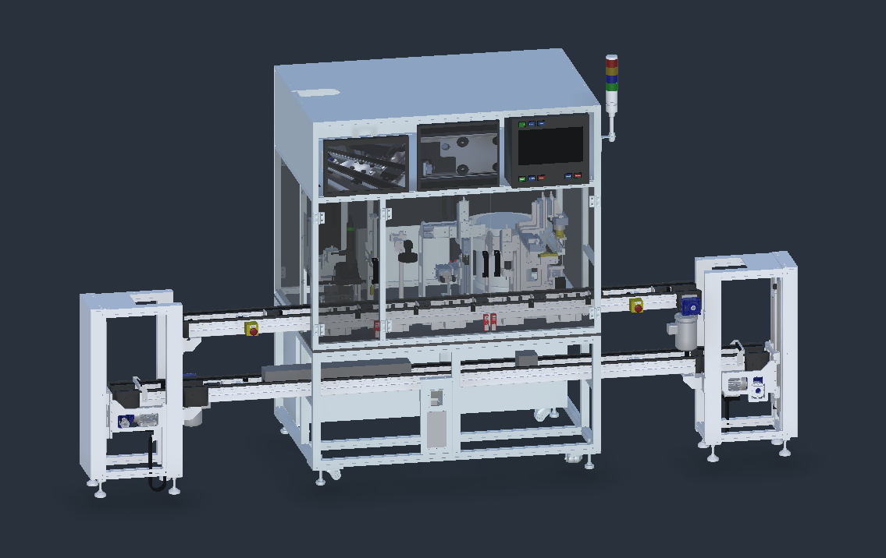

# DT_PSA_OPCV — Digital Twin for Laser Welding & Assembly System (PSA OPCV)

**A real production line, in software. Connect your PLC and run it.**

[](https://github.com/Preliy/DT_PSA_OPCV/releases)
[](COMPATIBILITY.md)
[](https://github.com/Preliy/DT_PSA_OPCV/wiki)
[](LICENSE)
[](CONTRIBUTING.md)



## Welcome

A Unity-based digital twin of a laser welding and assembly system, built for **virtual
commissioning**. The twin runs on **Open Commissioning Core** and the **Open Commissioning UI
framework**; **TwinCAT** is the simulation unit — it hosts the behaviour models and emulates the
real-time industrial fieldbus, so the twin and a control program meet over EtherCAT exactly as a
real cell does.

Pallets circulate on a two-level conveyor. Five stations work on the part as it passes: one
identifies it and marks it with a laser, one inspects it optically, one moves it between pallet
slots and flips it over, one presses it home and checks it seated, and the last fits a cap. Doors
interlock. Stations wait for each other. Things go wrong, and have to be reset properly.

**The difference is what drives it.** Your own PLC program can take over and run the whole machine —
and it cannot tell that the machine is not real.

## Why this one is different

Most virtual commissioning demos are three boxes on a conveyor belt, or an animation in a slide deck.
They look nice. You cannot learn much from them, and you certainly cannot test a control program
against one.

A model that is too kind is worse than no model at all. If the sensors always agree, if nothing ever
jams, if the simulation quietly helps the program along — then every program passes, including the
broken ones.

So this machine is built to be honest. It has the awkward parts that real machines have, the ones
that catch people out during real commissioning. If your program runs this line properly, that
actually tells you something.

## Three ways to run it

| | What happens |
|---|---|
| **Watch it** | The machine runs by itself, like an animation. [Download the Windows build](https://github.com/Preliy/DT_PSA_OPCV/releases/latest) and run it — no Unity, no PLC, nothing to install |
| **Test your program** | Your PLC program runs on your PC and drives the machine |
| **Test your hardware** | The same program runs on a real controller and drives the machine |

The second and third are the same setup — the only difference is where your PLC is. What you prove
on your desk still holds on the hardware.

## Who it is for

- **Controls engineers** who want a serious machine to write and test code against, without owning
  one.
- **Students and people learning automation**, who want to see how a real line is actually put
  together — the interlocks and the recovery, not just the happy path.
- **Anyone curious about virtual commissioning** who wants to judge it on a real example.

You need a PC. That is all.

## Getting it

The twin is one repository. Each **control platform is a separate, optional repository** you clone
into this one's root — take only the platform you use:

```bash
git clone https://github.com/Preliy/DT_PSA_OPCV.git
cd DT_PSA_OPCV

# optional - only if you want to run it on this platform
git clone https://github.com/Preliy/DT_PSA_OPCV_Beckhoff.git Beckhoff
```

The module paths are gitignored here, so the two repositories do not collide: inside `Beckhoff/`
everything is a normal checkout on a normal branch, and `git status` in the main repo never mentions
it. Nothing to initialise, nothing to keep in sync by hand.

### Control platforms

<!-- BEGIN GENERATED - do not edit between the markers. -->
| Module | Platform | Version | Status |
|---|---|---|---|
| [Beckhoff](https://github.com/Preliy/DT_PSA_OPCV_Beckhoff) | Beckhoff TwinCAT 3 | 1.0.0 | current |
| [Siemens](https://github.com/Preliy/DT_PSA_OPCV_Siemens) | Siemens TIA Portal | 0.1.0 | no handoff |
<!-- END GENERATED -->

Which module version pairs with which twin — and how a stale one is caught — is in
[COMPATIBILITY.md](COMPATIBILITY.md). The **vendor compatibility** badge above is that check
running weekly: green means every declared module still pairs with this twin.

## Bring your own control system

The machine belongs to no vendor. Beckhoff runs it today because that is what was built first.
Siemens is on the way. Anything else is wide open — and that is where help is most welcome.

Everything you would need is already written down: [what the machine is made
of](_docs/context/machine.md), and [exactly how it is supposed to
behave](_docs/reference/transport-behaviour.md). So you are building against a specification, not
guessing.

If you would like to bring your platform to it, we would love to hear from you.

**→ [How the setups are put together](_docs/04-architecture.md)** · **→ [CONTRIBUTING.md](CONTRIBUTING.md)**

## Where to start

| | |
|---|---|
| [**Introduction**](_docs/01-introduction.md) | What this project is and how it is put together |
| [**Setup**](_docs/02-setup.md) | Getting it running, on its own or with a PLC |
| [**Usage**](_docs/03-usage.md) | Moving around, and the controls |
| [**Glossary**](_docs/05-glossary.md) | PLC, MIL/SIL/HIL, fieldbus — every abbreviation in plain language |
| [**The machine**](_docs/context/machine.md) | Every station and device, with drawings |
| [**How it behaves**](_docs/reference/transport-behaviour.md) | Sequences, interlocks, faults and recovery |
| [**Full documentation**](_docs/README.md) | Everything else |

The same pages are browsable as a [Wiki](https://github.com/Preliy/DT_PSA_OPCV/wiki). Each control
platform keeps its own — the TwinCAT one is
[here](https://github.com/Preliy/DT_PSA_OPCV_Beckhoff/wiki) — and the two cross-link.

## Contributing

Contributions are genuinely wanted — a new control platform, a missing setup step, a bug you hit, or
a correction to something we got wrong. Start with [CONTRIBUTING.md](CONTRIBUTING.md).

## License

[GPL-3.0](LICENSE) — Copyright © 2026 Viktor Gaponenko.

Use it, learn from it, build on it. If you share a modified version, it stays open for the next
person.

## Credits

### The machine — [Villette Oh](https://grabcad.com/villette.oh-1)

This twin has a real machine behind it because someone drew one and gave it away. The CAD model —
[**Laser Welding & Assembly System (PSA
OPCV)**](https://grabcad.com/library/laser-welding-assembly-system-psa-opcv-1), published on
GrabCAD — is where every shape here comes from. Without it this would be one more demo with three
boxes on a conveyor. Thank you.

### Siemens expertise and PLC architecture — Andreas Fast

For the Siemens side, and for the PLC project architecture and design the control side is built on.

### [Open Commissioning](https://github.com/OpenCommissioning)

The framework the whole twin stands on: the `com.open-commissioning.core` and
`com.open-commissioning.ui` Unity packages, the OC TwinCAT library, and the OC Assistant tooling.

### Also used

| | |
|---|---|
| [`com.pilar.context`](https://github.com/Preliy/unity-pilar-context) | the engineering context carried by each part of the twin |
| [Unity-URP-Outline](https://github.com/CristianQiu/Unity-URP-Outline) | selection outlines |
| [UniTask](https://github.com/Cysharp/UniTask) | async sequences |
| [NaughtyAttributes](https://github.com/dbrizov/NaughtyAttributes) | editor tooling |

Every third-party component, with its version and licence, is listed in
[THIRD-PARTY-NOTICES.md](THIRD-PARTY-NOTICES.md).
