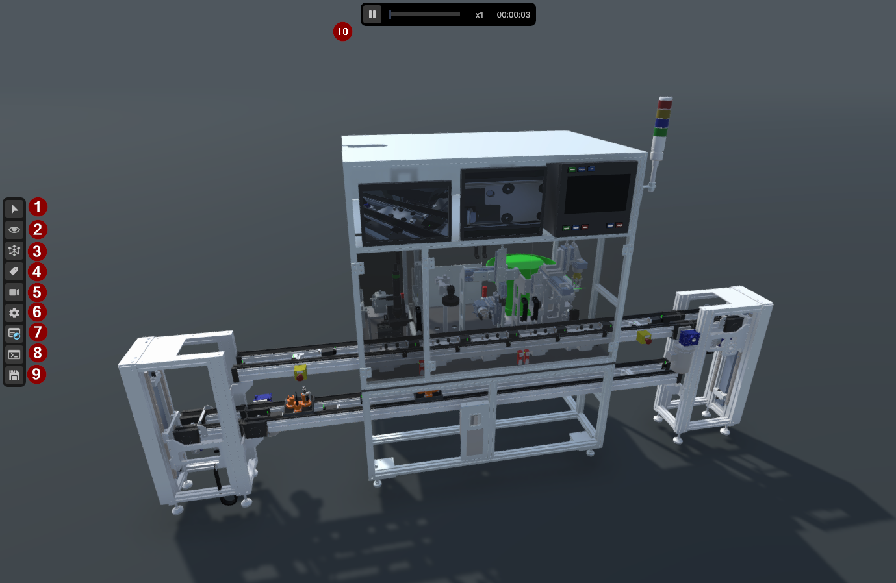

# Using the application

Moving around the twin, and the controls. For installing the toolchain, see
[01 · Setup](01-setup.md).

## 1. Starting it

### From a packaged build

1. Download the `.zip` archive from the [latest
   release](https://github.com/Preliy/DT_PSA_OPCV/releases/latest).
2. Extract it on your local machine.
3. Start the `.exe` from the archive folder.

### From the Unity Editor

Open the project in Unity and load the scene for the control platform you are using. Scenes live in
`Unity/Assets/Demo_1/Scenes/`.

| Scene | Use it for |
|---|---|
| `VC_Demo_1_MIL` | **MIL** — the twin on its own, no PLC. Needs nothing else installed |
| `VC_Demo_1_Beckhoff_1` | Running against the TwinCAT PLC. Adds the Beckhoff operator panel |
| `VC_Demo_1_Siemens_1` | The Siemens variant. Adds that vendor's panel — the PLC side is not written yet |

**With a PLC, start the runtime first, then enter Play mode.** The twin binds its devices on
connect, so a runtime that appears later is a runtime the twin never found. The rest of that
procedure is [04 · PLC connectivity](04-plc-connectivity.md).

## 2. Navigation

### 2.1 Camera control

| Input | Does |
|---|---|
| **Right click + drag** | Rotate the view |
| **Middle click + drag** | Pan the view |
| **Scroll wheel** | Zoom in / out |
| **Right click + WASD** | Move the camera forward, backward and sideways |
| **Right click + Q/E** | Move the camera down / up |

### 2.2 Selection

**Left click** on an object to select it. Selection has to be enabled first — turn on **Interaction
Mode** in the left side panel.

### 2.3 Interacting with the UI

**Left click** buttons, sliders and other UI elements.

## 3. User interface

The interface has three main operating modules, numbered in the picture above.

### 1–9 · Left side panel

| # | Tool | Does |
|---:|---|---|
| 1 | **Interaction Mode** | Activates selection of and interaction with objects in the scene |
| 2 | **Hide Menu** | Show or hide the geometry of specific parts of the model |
| 3 | **Material Flow** | Show or hide the material flow collision bodies |
| 4 | **Label Menu** | Show or hide the labels in the scene |
| 5 | **Camera Menu** | Jumps the camera to a predefined position |
| 6 | **Settings Menu** | Show or hide the scene settings |
| 7 | **Macros** | Project-defined action buttons |
| 8 | **Console Menu** | Show or hide the scene console |
| 9 | **Save / Load** | Save and restore the component layout |

### 10 · Time panel

Pause the application, or use the time factor slider to change the simulation speed. The panel also
shows the elapsed run time.

### Industrial panel

Shows or hides the predefined industrial HMIs — the operator panel and the monitors modelled on the
machine itself.

## 4. Hot keys

| Key | Does |
|---|---|
| **Selection + F** | Jumps the camera to the selected object in the scene |
| **F12** | Switch between full screen and windowed mode |
| **ESC** | Exit the application |

## 5. Operating the machine

**What operates the machine depends on which scene you opened**, and the difference matters more
than it looks — MIL and the PLC scenes do not implement the same machine.

### MIL — it runs itself

In `VC_Demo_1_MIL` no control system is involved: C# coroutines under
`Unity/Assets/Demo_1/Scripts/MIL/` drive the devices directly, so the line runs by itself. Useful
for showing the machine, checking geometry, or working on the twin with nothing else installed.

> **Do not read the machine's behaviour out of the MIL scripts.** They are the twin's *animation*
> and implement an **older contract** — no transfer latch, no check that a lift is at a level before
> running its carriage belt, and no reset path at all. A handshake copied from them reproduces bugs
> that have already been fixed. The behaviour that counts is written down in the [behaviour
> contracts](reference/transport-behaviour.md), and the control program is master for it.

### With a PLC — you operate it

In a vendor scene, **nothing in Unity decides what the machine does** — every motion is commanded by
the control program, and the twin only reports its sensors back. Operate it from the on-screen
control panel, or from the platform's own HMI.

**Each platform's panel is different**, because each scene adds its own. The Beckhoff scene carries
eight PackML buttons; the Siemens scene carries seven controls including a rotary switch. How to
actually run the sequence belongs to the platform:

| Platform | How to run it |
|---|---|
| **Beckhoff / TwinCAT** | [Beckhoff usage guide](https://github.com/Preliy/DT_PSA_OPCV_Beckhoff/blob/master/_docs/02-usage.md) |
| **Siemens / TIA** | Not yet — the control side does not exist |
| **Your own** | [04 · PLC connectivity](04-plc-connectivity.md) |

## 6. What you are looking at

Every device on screen has a name and a PLC path, and both are documented:

- Turn on **Label Menu** (tool 4) to see the names in the scene itself.
- The figure and device table for each group — [the machine pages](06-machine-description.md).
- Every twin device in one table — [devices and PLC paths](context/plc-symbols.md).
