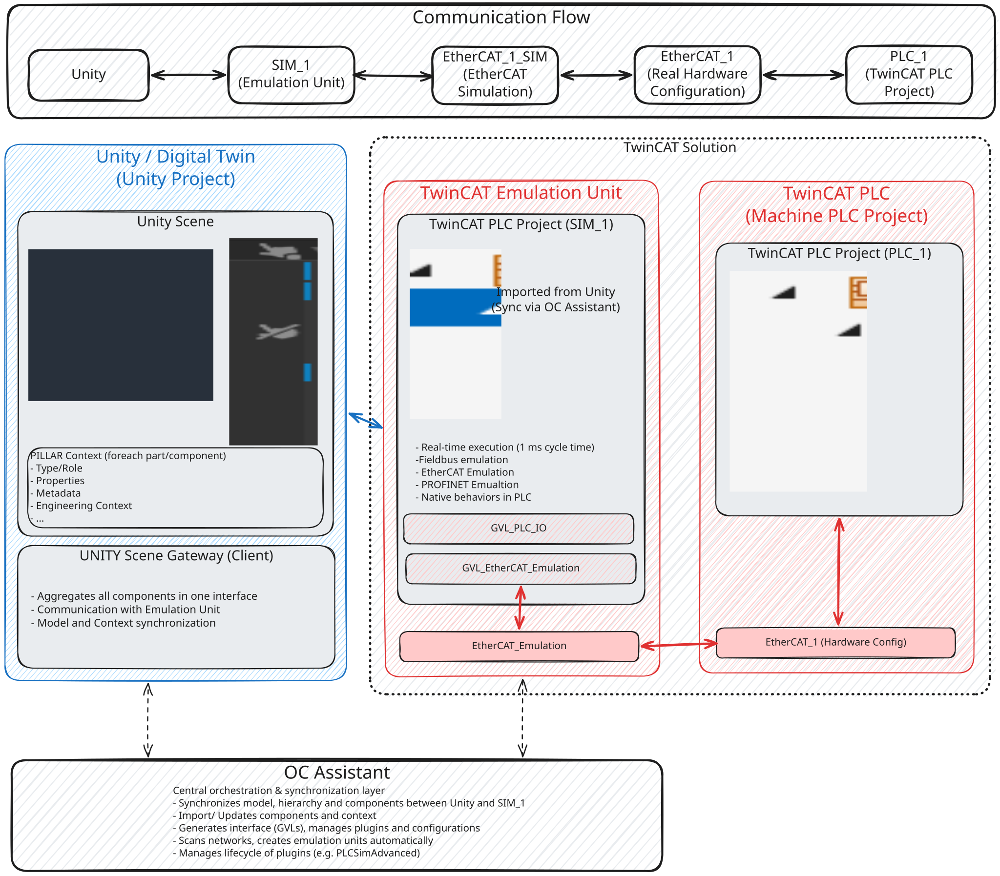
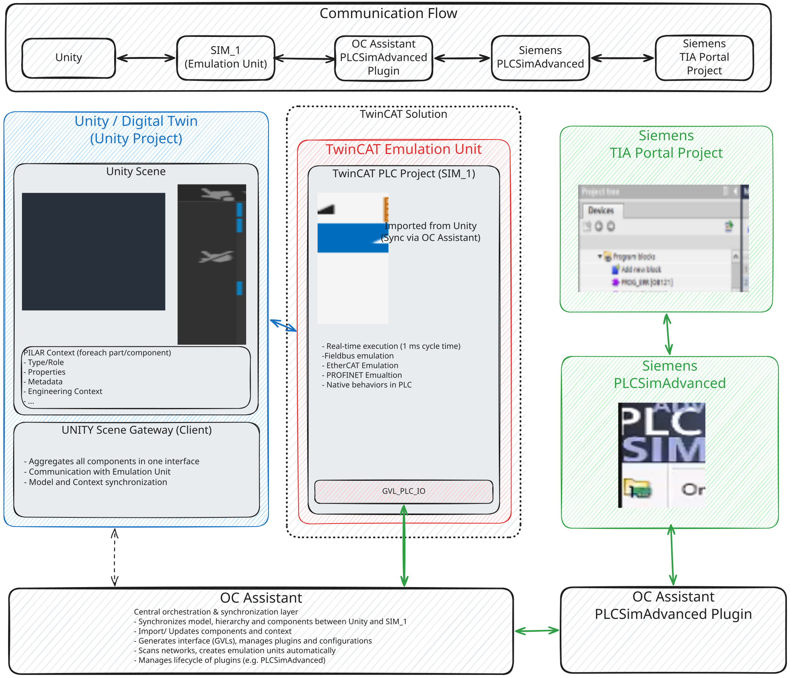

# Architecture

How the digital twin is put together, and how a control program gets to drive it.

The project is built on [Open Commissioning](https://github.com/OpenCommissioning), and an Open
Commissioning setup always has the **same two parts**. Everything else on this page is a variation on
them.

> This page uses the trade names as they are: [05 · Glossary](05-glossary.md) has them in plain
> language.

## 1. The two parts

### Unity — the digital twin

The Unity scene is where the twin lives. The model is a **hierarchy of parts and components** —
actors, sensors, drives, cylinders — assembled into a hierarchical kinematic, so a movement applied
to a parent carries everything mounted on it. Together with **PILAR Context**, each part also carries
its engineering context: its type and role, its properties, its metadata.

The scene's **Client** is the gateway. It aggregates every component in the scene into one interface
and owns the connection to the second part.

### The emulation unit — TwinCAT

The emulation unit is a TwinCAT PLC project (`SIM_1`) holding the **same hierarchy and the same
component list as Unity**, imported and kept in sync from the Unity side by **OC Assistant**.

**Why TwinCAT.** It runs in real time at a 1 ms cycle, and it can host an emulated industrial
fieldbus — EtherCAT emulation, emulated PROFINET devices. Real-time execution plus an emulated
fieldbus is what lets the behaviour models run under the timing a PLC actually imposes, and it is
what makes high-quality field device simulation possible at all. That matters for everything
time-critical: drives, safety, fast I/O, and acyclic data exchange.

### OC Assistant holds the two together

OC Assistant is the orchestration and synchronisation layer between them. It synchronises the model,
the hierarchy and the components between Unity and `SIM_1`, imports and updates components and their
context, generates the interface GVLs, scans networks and creates emulation units, and manages the
lifecycle of its plugins.

## 2. The vendor-specific setups

The two parts above never change. What is added on the control side does — and that is the whole of
what makes a setup Beckhoff-shaped or Siemens-shaped.

### Digital twin with a TwinCAT PLC



Same base setup — Unity plus the emulation unit — with a **second TwinCAT PLC project, `PLC_1`**,
carrying the machine program. Alongside it goes the **real hardware configuration**: an `EtherCAT_1`
master with all its terminals, exactly as the cell would be wired. From that master an
`EtherCAT_1_SIM` simulation device is created; the two are coupled and run in full emulation.

```
Unity ⇄ SIM_1 ⇄ EtherCAT_1_SIM ⇄ EtherCAT_1 ⇄ PLC_1
```

This is the setup this repository runs today. Its concrete projects, ports and terminals are
documented by the
[Beckhoff module](https://github.com/Preliy/DT_PSA_OPCV_Beckhoff/blob/master/_docs/03-architecture.md).

### Digital twin with Siemens PLCSIM Advanced



Same base setup. OC Assistant's **PLCSIM Advanced plugin** creates an extra GVL in `SIM_1`, and that
GVL is the interface to the PLCSIM Advanced I/O. OC Assistant manages the plugin's lifecycle.

```
Unity ⇄ SIM_1 ⇄ PLCSIM Advanced plugin ⇄ PLCSIM Advanced ⇄ TIA Portal project
```

### Digital twin with a Siemens PLC

Same base setup again. OC Assistant scans the **PROFINET** fieldbus and creates the emulation unit as
a PROFINET master automatically, with the matching GVL in the emulation project.

## 3. Why the indirection is the point

In every one of those setups the control program talks to **fieldbus terminals**, never to Unity. The
twin sits behind the simulated side of the bus.

That is what makes the result mean something: the control program cannot tell it is running against a
twin, so nothing about it has to change when it runs against steel. A test rig the program is aware
of proves much less.

It is also why **SIL and HIL are the same setup** — the twin, the emulation unit and the control
program are identical, and only where the PLC executes changes.

## 4. The Unity packages

| Package | Provides |
|---|---|
| `com.open-commissioning.core` | Device components (`Cylinder`, `SensorBinary`, `DriveSimple`, …), the `Client` gateway and its transport, the hierarchy model |
| `com.open-commissioning.ui` | The runtime application UI — toolbar, selection, cameras, industrial panels |
| `com.pilar.context` | The authored engineering context on each part |

Project-specific behaviour is small and lives in `Unity/Assets/Demo_1/Scripts/`:
`ControlBunker`, `DataReader`, `GripSensor`, `PartPressDetector`, plus the `MIL/` animation
coroutines.

## 5. One machine, one prefab, one scene per vendor

The machine is a **prefab** — `Unity/Assets/Demo_1/Prefabs/Machine_1.prefab` — and every scene under
`Unity/Assets/Demo_1/Scenes/` instances it. What a scene adds is its vendor's operator panel and the
`Client` for that setup:

| Scene | Adds |
|---|---|
| `VC_Demo_1_Beckhoff_1` | `H_ControlPanel` → `MAIN.FG_System.H_ControlPanel`, 8 PackML buttons |
| `VC_Demo_1_Siemens_1` | `H_ControlPanel` → `MAIN.FG_System.H_ControlPanel_Siemens`, 7 controls incl. a rotary switch |

A device that belongs to every vendor lives in the prefab, so there is exactly one copy of it.
Editing one scene's copy of a shared device is a mistake the build detects: the node stops being
identical across scenes and starts being marked `†` on the generated pages.

**Read `†` as "this is one vendor's example".** The generated machine pages are rendered from one
reference scene, currently Beckhoff. What is unmarked is the machine.

## 6. Where the facts live

The project keeps three kinds of fact apart, because each has a different owner and a different
lifetime. Mixing them is how documentation starts to lie.

| | The question it answers | Where it is written | By |
|---|---|---|---|
| **Structure** | Which devices exist, what type each is, what its address is | [`context/`](context/) | a generator, straight from the Unity twin |
| **Behaviour** | What the machine has to *do* — sequences, interlocks, faults, recovery | [`reference/`](reference/) | a human, once, for every platform |
| **Realisation** | How one particular PLC spells all that — function blocks, terminals, the HMI | each vendor's own repository | that platform's maintainers |

Structure is generated because it can be *read* out of the twin, so a generated page cannot drift
away from the machine. That is also why editing a page under `context/` achieves nothing: the next
build overwrites it. Change the Unity scene instead.

Behaviour is written by hand because it cannot be read out of anything — a sequence is a decision,
and guessing one from a hierarchy produces something plausible and wrong. It is written once and
platform-neutrally, so a Siemens implementation has to satisfy exactly the same contract the TwinCAT
one does.

Realisation is one answer per platform, so it lives with that platform and nowhere else.

What crosses from this repository into a vendor's is a single generated file,
[`context/.machine.json`](context/.machine.json) — the machine's structure as schema-versioned JSON.
It crosses as a **copy, not a reference**: each module commits its own snapshot, so it builds from a
standalone clone with no Unity present.

**The twin path is not the control path.** The twin says `MAIN.FG_01.P_Camera`; TwinCAT says
`MAIN.Machine.FG_01.P_Camera`. The twin's spelling fails *silently* in a link and in an HMI binding,
so the machine pages state the twin path, and the verified control path is on the platform's page.

## 7. Other control platforms

Beckhoff/TwinCAT runs this machine today because that is what was built first — nothing in the twin
is Beckhoff-shaped. **Support for further vendor platforms is planned**, Siemens first, and the
project is meant to keep growing that way.

**Contributions are very welcome** — a new control platform, a missing setup step, or a correction.
See [CONTRIBUTING.md](../CONTRIBUTING.md), or open an issue to say what you are starting.
