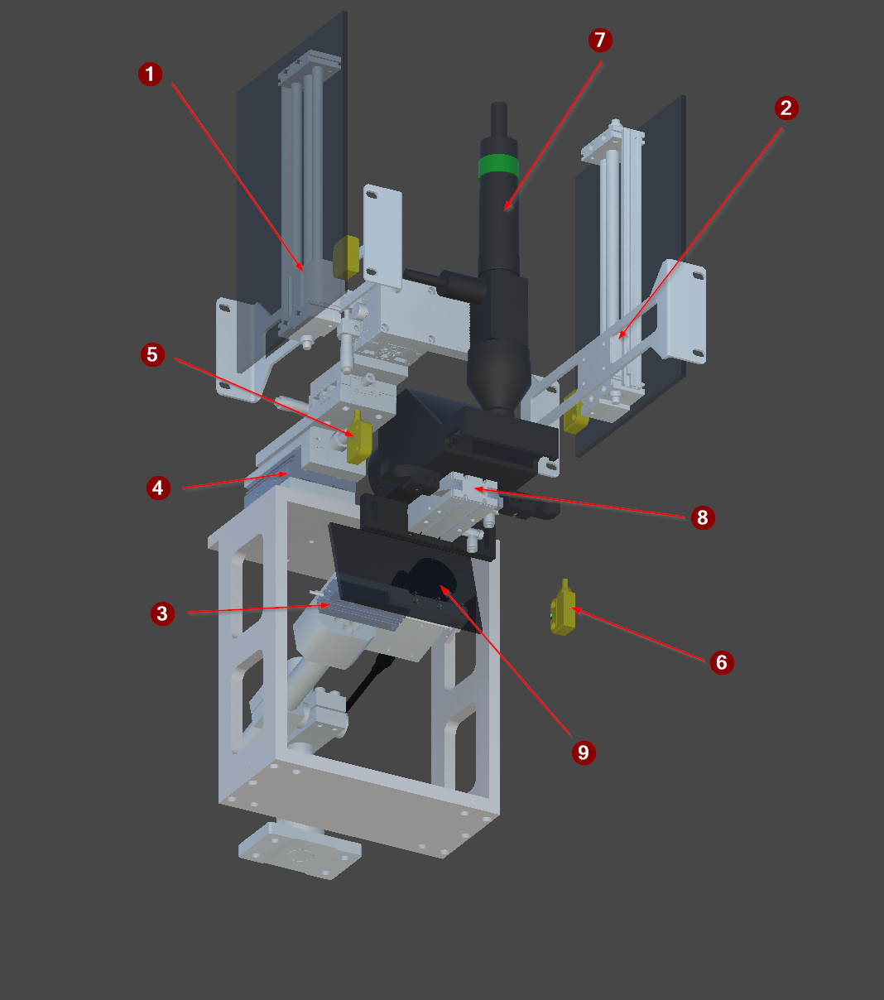

<!-- GENERATED from the Unity twin - do not edit. The build sweeps this directory and deletes anything it did not write; see _workflow/README.md. -->
<!-- Source: Unity/Assets/StreamingAssets/<Scene>_Context.json (structure and prose) and <Scene>_Project_Tree.xml (the device list), for every exported vendor scene. Edit the scene's ContextNodes, then re-run refreshing-project-knowledge. The control side is on the vendor page linked from here. -->

# FG_01

| | |
|---|---|
| Scene path | `Project/FG_01` |
| Twin PLC path | `MAIN.FG_01` |
| Served by | `Index01` (FG_Transport) |
| Symbols | 9 |
| Behaviour | [`fg-01-behaviour.md`](../reference/fg-01-behaviour.md) |

Identifies the payload and applies a laser mark. The camera reads the serial number the part carries; the mark content is abstract, and FG_02 reads it back.

## Figure



*The FG_01 identify and mark station, isolated.*

## Devices

| # | Device | Type | Twin FB | Twin PLC path | What it does |
|---:|---|---|---|---|---|
| 1 | `Y_Gate1` | [Cylinder](devices/cylinder.md) | `FB_Cylinder` | `MAIN.FG_01.Y_Gate1` | Guard gate cylinder. Closes to shield the cell during laser marking and opens to let pallets pass. Normal state gate opened (Home Position) (Top Position) |
| 2 | `Y_Gate2` | [Cylinder](devices/cylinder.md) | `FB_Cylinder` | `MAIN.FG_01.Y_Gate2` | Guard gate cylinder. Closes to shield the cell during laser marking and opens to let pallets pass. Normal state gate opened (Home Position) (Top Position) |
| 3 | `Y_ReaderWindow` | [Cylinder](devices/cylinder.md) | `FB_Cylinder` | `MAIN.FG_01.Y_ReaderWindow` | Pneumatic window in front of P_Reader, doubling as the camera shield. Closed while the laser fires, opened for the read. |
| 4 | `Y_Platform` | [Cylinder](devices/cylinder.md) | `FB_Cylinder` | `MAIN.FG_01.Y_Platform` | Moves the laser head. Service mode only - SequenceUnit1 takes override control of it on enable and releases on disable, but never actuates it during the normal cycle. |
| 5 | `B_SafetyGate1` | [SensorBinary](devices/sensorbinary.md) | `FB_SensorBinary` | `MAIN.FG_01.B_SafetyGate1` | Safety sensor monitoring a guard gate position. |
| 6 | `B_SafetyGate2` | [SensorBinary](devices/sensorbinary.md) | `FB_SensorBinary` | `MAIN.FG_01.B_SafetyGate2` | Safety sensor monitoring a guard gate position. |
| 7 | `Y_LaserMark` | [LinkByte](devices/linkbyte.md) | `FB_DeviceByte` | `MAIN.FG_01.Y_LaserMark` | — |
| 8 | `Y_Gripper` | [Cylinder](devices/cylinder.md) | `FB_Cylinder` | `MAIN.FG_01.Y_Gripper` | Two finger clamp that holds the payload steady for the duration of marking and reading. |
| 9 | `P_Camera` | [DataReader](devices/datareader.md) | `FB_Camera` | `MAIN.FG_01.P_Camera` | Reads the serial number the payload carries. It runs after the laser fires but does not verify the mark - FG_02 does that. |

`#` is the numbered arrow on the figure above.

**The twin path is not the control path.** A control platform spells these devices differently - it may fold a twin child into its parent unit, or address it from another root entirely - and only the control spelling works in a binding or a link, where the twin's fails silently. The verified control path for each row is on the vendor page linked below.

## Bit mapping

`Control` is what the PLC writes and the twin obeys; `Status` is what the twin reports and the PLC reads. Which member a device uses is on its [device type page](devices/).

### `P_Camera` — DataReader

| Symbol | Meaning |
|---|---|
| `Control.0` | enable |
| `Control.1` | trigger |
| `Status.0` | Ready |
| `Status.1` | Busy |
| `Status.2` | ResultValid |
| `Status.3` | ResultOK |

2 of 8 control bits and 4 of 8 status bits used. The remaining bits are unused and unmapped. ResultOK is meaningless unless ResultValid is set.

## Hierarchy

The scene tree. The comment on each line is what the node is; `†` marks one that differs between scenes.

```yaml
Barcode Reader:    # grouping, not a device
  P_Camera:        # DataReader
  Y_ReaderWindow:  # Cylinder
    Axis:          # grouping, not a device
Laser Unit:        # grouping, not a device
  Y_Platform:      # Cylinder
  Axis:            # grouping, not a device
    Y_LaserMark:   # LinkByte
      DataReader:  # grouping, not a device
Y_Gripper:         # Cylinder
  Finger_1:        # grouping, not a device
  Finger_2:        # grouping, not a device
Y_Gate1:           # Cylinder
  Axis:            # grouping, not a device
Y_Gate2:           # Cylinder
  Axis:            # grouping, not a device
B_SafetyGate1:     # SensorBinary
B_SafetyGate2:     # SensorBinary
```

## Unity

Twin animation: [`SequenceUnit1.cs`](../../Unity/Assets/Demo_1/Scripts/MIL/SequenceUnit1.cs) — behaviour contract is in [transport-behaviour.md](../reference/transport-behaviour.md)

### Notes

**Barcode Reader** — `MAIN.FG_01.Barcode Reader` · not a PLC symbol
- *Function* — Verification sub assembly - the optical reader behind a pneumatic window that shields it while the laser fires.

**P_Camera** — `MAIN.FG_01.P_Camera` · DataReader
- *Signal* — Enable, then trigger; reads back Ready, Busy, ResultValid and ResultOK. The twin echoes the two control bits and hands over the datum; the verdict is synthesised in OC_SIM FB_Camera.

**Y_ReaderWindow** — `MAIN.FG_01.Y_ReaderWindow` · Cylinder
- *Signal* — Double solenoid with both limits read. EXTENDED opens the window for the read; retracted shields the optics and is home.

**Axis** — `` · not a PLC symbol
- *Function* — Kinematic axis that slides the reader window in front of the camera.
- *Twin* — OC Axis driven by the Y_ReaderWindow cylinder. The window doubles as the camera shield during marking.

**Laser Unit** — `MAIN.FG_01.Laser Unit` · not a PLC symbol
- *Function* — Marking sub assembly - the laser head, its service mode platform cylinder and the kinematic axis they ride on.

**Y_Platform** — `MAIN.FG_01.Y_Platform` · Cylinder
- *Signal* — Double solenoid with both limits read. Service positioning of the laser head. Never actuated during the production cycle.

**Axis** — `MAIN.FG_01.Axis` · not a PLC symbol
- *Function* — Kinematic axis carrying the laser head, driven by the Y_Platform service cylinder.

**Y_LaserMark** — `MAIN.FG_01.Y_LaserMark` · LinkByte
- *Signal* — One control bit out enables the laser module; held high for 1 s it applies the mark. NO status bits - the PLC gets no confirmation that it fired.
- *Twin* — LinkByte plus ActorStateColor for the beam visual. Its DataReader child is what actually writes the mark onto the payload.
- *Approximation* — The mark is one number written to a payload key, not geometry. Nothing is engraved and nothing can be inspected other than by reading that key back.

**DataReader** — `` · not a PLC symbol
- *Function* — Writes the LaserMark datum onto the payload under the laser.
- *Twin* — OC DataReader on a Rigidbody - despite the name it both reads and writes, via Read() and Write(float). Keyed by _key, which here is LaserMark.
- *Caution* — FG_01 WRITES LaserMark here but READS SerialNumber with its camera. It never verifies its own mark - FG_02 is what reads LaserMark back.

**Y_Gripper** — `MAIN.FG_01.Y_Gripper` · Cylinder
- *Signal* — Double solenoid with both limits read. EXTENDED clamps the payload for marking and reading; retracted releases.

**Finger_1** — `` · not a PLC symbol
- *Function* — One jaw of a two-finger gripper. Cosmetic kinematics only.
- *Twin* — OC Axis driven by the gripper cylinder. Carries no payload itself - the Gripper sibling holds it.

**Finger_2** — `` · not a PLC symbol
- *Function* — One jaw of a two-finger gripper. Cosmetic kinematics only.
- *Twin* — OC Axis driven by the gripper cylinder. Carries no payload itself - the Gripper sibling holds it.

**Y_Gate1** — `MAIN.FG_01.Y_Gate1` · Cylinder
- *Role* — Guard gate 1. Must be closed before the FG_01 laser may fire.
- *Signal* — Extending CLOSES the gate, retracting OPENS it, and retracted is home - the opposite sense to a transport stopper. Both limits are read; the two gates are commanded together.

**Axis** — `` · not a PLC symbol
- *Function* — Kinematic axis that swings the laser guard gate.
- *Twin* — OC Axis on the Gate Typ 1 prefab.
- *Caution* — EXTENDING CLOSES the gate; retracted is home and OPEN. The opposite sense to a transport stopper, and the thing most often got backwards here.

**Y_Gate2** — `MAIN.FG_01.Y_Gate2` · Cylinder
- *Role* — Guard gate 2. Must be closed before the FG_01 laser may fire.
- *Signal* — Extending CLOSES the gate, retracting OPENS it, and retracted is home - the opposite sense to a transport stopper. Both limits are read; the two gates are commanded together.

**Axis** — `` · not a PLC symbol
- *Function* — Kinematic axis that swings the laser guard gate.
- *Twin* — OC Axis on the Gate Typ 1 prefab.
- *Caution* — EXTENDING CLOSES the gate; retracted is home and OPEN. The opposite sense to a transport stopper, and the thing most often got backwards here.

**B_SafetyGate1** — `MAIN.FG_01.B_SafetyGate1` · SensorBinary
- *Role* — Monitors guard gate 1 for the FG_01 laser interlock.
- *Signal* — Binary presence sensor. Monitors a guard gate. Must be Active, with both gates at their extended limit, before the laser may fire.

**B_SafetyGate2** — `MAIN.FG_01.B_SafetyGate2` · SensorBinary
- *Role* — Monitors guard gate 2 for the FG_01 laser interlock.
- *Signal* — Binary presence sensor. Monitors a guard gate. Must be Active, with both gates at their extended limit, before the laser may fire.

## Control implementations

The twin is master for **structure**, and that is all this page states. The control module, the twin device layer, the verified control PLC paths and the terminal mapping is the control platform's own knowledge base:

- [Beckhoff](https://github.com/Preliy/DT_PSA_OPCV_Beckhoff/blob/master/_docs/context/fg-01.md)
- **Siemens** — _no knowledge base published yet_
