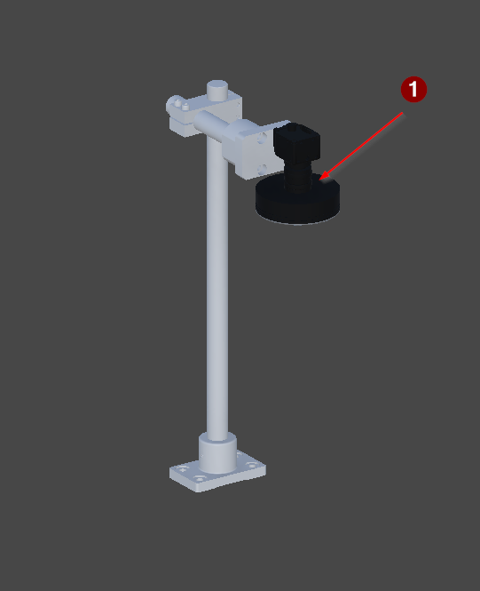

<!-- GENERATED from the Unity twin - do not edit. The build sweeps this directory and deletes anything it did not write; see _workflow/README.md. -->
<!-- Source: Unity/Assets/StreamingAssets/<Scene>_Context.json (structure and prose) and <Scene>_Project_Tree.xml (the device list), for every exported vendor scene. Edit the scene's ContextNodes, then re-run refreshing-project-knowledge. The control side is on the vendor page linked from here. -->

# FG_02

| | |
|---|---|
| Scene path | `Project/FG_02` |
| Twin PLC path | `MAIN.FG_02` |
| Served by | `Index02` (FG_Transport) |
| Symbols | 1 |
| Behaviour | [`fg-02-behaviour.md`](../reference/fg-02-behaviour.md) |

Optical inspection. A camera above the pallet reads back the mark FG_01 applied and reports OK or not OK.

## Figure



*The FG_02 optical inspection station, isolated.*

## Devices

| # | Device | Type | Twin FB | Twin PLC path | What it does |
|---:|---|---|---|---|---|
| 1 | `P_Camera` | [DataReader](devices/datareader.md) | `FB_Camera` | `MAIN.FG_02.P_Camera` | Reads back the LaserMark datum FG_01 wrote onto the payload. This is the station that verifies the mark - FG_01 applies it and reads only the serial number. |

`#` is the numbered arrow on the figure above.

**The twin path is not the control path.** A control platform spells these devices differently - it may fold a twin child into its parent unit, or address it from another root entirely - and only the control spelling works in a binding or a link, where the twin's fails silently. The verified control path for each row is on the vendor page linked below.

## Bit mapping

`Control` is what the PLC writes and the twin obeys; `Status` is what the twin reports and the PLC reads. Which member a device uses is on its [device type page](devices/).

### `P_Camera` — DataReader

| Symbol | Meaning |
|---|---|
| `Control.0` | enable |
| `Control.1` | trigger |
| `Status.0` | Ready |
| `Status.1` | Busy |
| `Status.2` | ResultValid |
| `Status.3` | ResultOK |

2 of 8 control bits and 4 of 8 status bits used. The remaining bits are unused and unmapped. ResultOK is meaningless unless ResultValid is set.

## Hierarchy

The scene tree. The comment on each line is what the node is; `†` marks one that differs between scenes.

```yaml
P_Camera:  # DataReader
```

## Unity

Twin animation: [`SequenceUnit2.cs`](../../Unity/Assets/Demo_1/Scripts/MIL/SequenceUnit2.cs) — behaviour contract is in [transport-behaviour.md](../reference/transport-behaviour.md)

### Notes

**P_Camera** — `MAIN.FG_02.P_Camera` · DataReader
- *Signal* — Enable, then trigger; reads back Ready, Busy, ResultValid and ResultOK. The twin echoes the two control bits and hands over the datum; the verdict is synthesised in OC_SIM FB_Camera.

## Control implementations

The twin is master for **structure**, and that is all this page states. The control module, the twin device layer, the verified control PLC paths and the terminal mapping is the control platform's own knowledge base:

- [Beckhoff](https://github.com/Preliy/DT_PSA_OPCV_Beckhoff/blob/master/_docs/context/fg-02.md)
- **Siemens** — _no knowledge base published yet_
