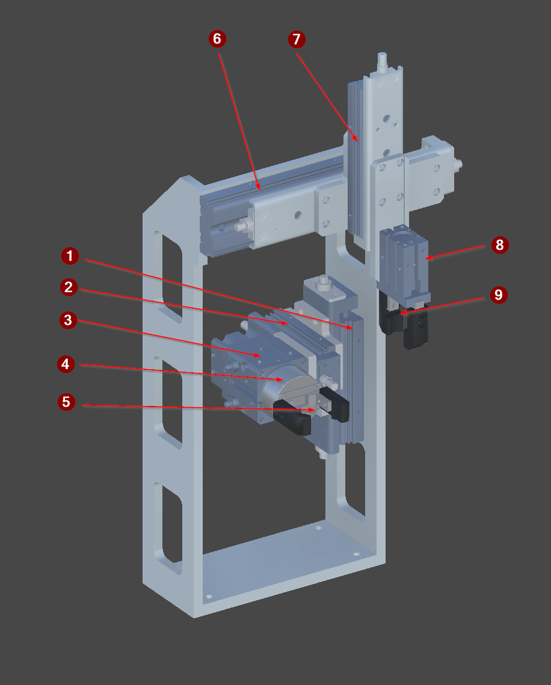

<!-- GENERATED from the Unity twin - do not edit. The build sweeps this directory and deletes anything it did not write; see _workflow/README.md. -->
<!-- Source: Unity/Assets/StreamingAssets/<Scene>_Context.json (structure and prose) and <Scene>_Project_Tree.xml (the device list), for every exported vendor scene. Edit the scene's ContextNodes, then re-run refreshing-project-knowledge. The control side is on the vendor page linked from here. -->

# FG_03

| | |
|---|---|
| Scene path | `Project/FG_03` |
| Twin PLC path | `MAIN.FG_03` |
| Served by | `Index03` (FG_Transport) |
| Symbols | 9 |
| Behaviour | [`fg-03-behaviour.md`](../reference/fg-03-behaviour.md) |

Transfers the part from slot 1 to slot 2 of the pallet, flipping it 180 degrees on the way. A newly created payload carries its part in slot 1 on the right hand side.

## Figure



*The FG_03 transfer station, isolated. Two gantries move the part from pallet slot 1 to slot 2.*

## Devices

| # | Device | Type | Twin FB | Twin PLC path | What it does |
|---:|---|---|---|---|---|
| 1 | `Y_AxisX1` | [Cylinder](devices/cylinder.md) | `FB_Cylinder` | `MAIN.FG_03.Y_AxisX1` | VERTICAL axis for arm 1, despite the X in the name. Max is raised, and arm 1 stays there for the whole cycle; min is only the power-on rest position. Arm 2 names its axes the opposite way round. |
| 2 | `Y_AxisY1` | [Cylinder](devices/cylinder.md) | `FB_Cylinder` | `MAIN.FG_03.Y_AxisY1` | HORIZONTAL traverse for arm 1, despite the Y in the name. Min is home over slot 2, max is the transfer position. Arm 2 names its axes the opposite way round. |
| 3 | `Y_AxisR1` | [Cylinder](devices/cylinder.md) | `FB_Cylinder` | `MAIN.FG_03.Y_AxisR1` | Rotates arm 1 through 180 degrees. Retracted (0 deg) is home and the receiving orientation; extended (180 deg) is the placing one. The flip is also what lowers the part into slot 2. |
| 4 | `Y_Gripper1` | [Cylinder](devices/cylinder.md) | `FB_Cylinder` | `MAIN.FG_03.Y_Gripper1` | Gripper on arm 1, the placing arm. Receives the part from arm 2 at the handover and releases it into slot 2. |
| 5 | `B_Detect1` | [SignalBinary](devices/signalbinary.md) | `FB_SensorBinary` | `MAIN.FG_03.B_Detect1` | Grip sensor on arm 1, the placing arm. Reports whether Y_Gripper1 is actually holding the part, which the cylinder limit cannot. |
| 6 | `Y_AxisX2` | [Cylinder](devices/cylinder.md) | `FB_Cylinder` | `MAIN.FG_03.Y_AxisX2` | Horizontal traverse for arm 2, the picking arm. |
| 7 | `Y_AxisY2` | [Cylinder](devices/cylinder.md) | `FB_Cylinder` | `MAIN.FG_03.Y_AxisY2` | Vertical stroke for arm 2, lowering it to pick the part out of slot 1. |
| 8 | `Y_Gripper2` | [Cylinder](devices/cylinder.md) | `FB_Cylinder` | `MAIN.FG_03.Y_Gripper2` | Gripper on arm 2, the picking arm. Takes the part out of slot 1 and holds it until the handover to arm 1. |
| 9 | `B_Detect2` | [SignalBinary](devices/signalbinary.md) | `FB_SensorBinary` | `MAIN.FG_03.B_Detect2` | Grip sensor on arm 2, the picking arm. Reports whether Y_Gripper2 is actually holding the part, which the cylinder limit cannot. |

`#` is the numbered arrow on the figure above.

**The twin path is not the control path.** A control platform spells these devices differently - it may fold a twin child into its parent unit, or address it from another root entirely - and only the control spelling works in a binding or a link, where the twin's fails silently. The verified control path for each row is on the vendor page linked below.

## Bit mapping

_None._

## Hierarchy

The scene tree. The comment on each line is what the node is; `†` marks one that differs between scenes.

```yaml
Y_AxisX1:            # Cylinder
Y_AxisX2:            # Cylinder
Axis_X1:             # grouping, not a device
  Y_AxisY1:          # Cylinder
  Axis_Y1:           # grouping, not a device
    Y_AxisR1:        # Cylinder
      Axis_R1:       # grouping, not a device
        Y_Gripper1:  # Cylinder
          Finger_1:  # grouping, not a device
          Finger_2:  # grouping, not a device
          Gripper:   # grouping, not a device
    B_Detect1:       # SignalBinary
Axis_X2:             # grouping, not a device
  Y_AxisY2:          # Cylinder
  Axis_Y2:           # grouping, not a device
    Y_Gripper2:      # Cylinder
      Finger_1:      # grouping, not a device
      Finger_2:      # grouping, not a device
      Gripper:       # grouping, not a device
    B_Detect2:       # SignalBinary
```

## Unity

Twin animation: [`SequenceUnit3.cs`](../../Unity/Assets/Demo_1/Scripts/MIL/SequenceUnit3.cs) — behaviour contract is in [transport-behaviour.md](../reference/transport-behaviour.md)

### Notes

**Y_AxisX1** — `MAIN.FG_03.Y_AxisX1` · Cylinder
- *Signal* — Double solenoid with both limits read. MAX is raised; arm 1 rises once and stays up for the whole cycle.

**Y_AxisX2** — `MAIN.FG_03.Y_AxisX2` · Cylinder
- *Signal* — Double solenoid with both limits read. MAX is the transfer position, min is home over slot 1.

**Axis_X1** — `MAIN.FG_03.Axis_X1` · not a PLC symbol
- *Function* — Kinematic joint of the two arm transfer unit, driven by the matching Y_ cylinder. Carries motion only and is not a PLC device in its own right.

**Y_AxisY1** — `MAIN.FG_03.Y_AxisY1` · Cylinder
- *Signal* — Double solenoid with both limits read. MAX is the transfer position, min is home over slot 2.

**Axis_Y1** — `MAIN.FG_03.Axis_Y1` · not a PLC symbol
- *Function* — Kinematic joint of the two arm transfer unit, driven by the matching Y_ cylinder. Carries motion only and is not a PLC device in its own right.

**Y_AxisR1** — `MAIN.FG_03.Y_AxisR1` · Cylinder
- *Signal* — Double solenoid with both limits read. Rotary. Retracted is 0 deg and the receiving orientation; extended is 180 deg and the placing one.

**Axis_R1** — `MAIN.FG_03.Axis_R1` · not a PLC symbol
- *Function* — Kinematic joint of the two arm transfer unit, driven by the matching Y_ cylinder. Carries motion only and is not a PLC device in its own right.

**Y_Gripper1** — `MAIN.FG_03.Y_Gripper1` · Cylinder
- *Signal* — Double solenoid with both limits read. EXTENDED grips. The limit proves the jaws moved, NOT that they caught anything - only B_Detect1 says that.

**Finger_1** — `` · not a PLC symbol
- *Function* — One jaw of a two-finger gripper. Cosmetic kinematics only.
- *Twin* — OC Axis driven by the gripper cylinder. Carries no payload itself - the Gripper sibling holds it.

**Finger_2** — `` · not a PLC symbol
- *Function* — One jaw of a two-finger gripper. Cosmetic kinematics only.
- *Twin* — OC Axis driven by the gripper cylinder. Carries no payload itself - the Gripper sibling holds it.

**Gripper** — `` · not a PLC symbol
- *Function* — Payload carrier for arm 1, the placing arm. Holds the part between the handover and slot 2.
- *Twin* — OC Gripper on a Rigidbody. The parent Cylinder's events drive it: OnLimitMax calls Pick, OnLimitMin calls Place, and OnActiveChanged calls Place(IsActive).
- *Approximation* — IsPicked is the gripper's own record of what it took, and B_Detect1 reads it, so it cannot report a part the gripper has SILENTLY LOST. Real hardware would use a beam.
- *Caution* — Cylinder.IsActive means MOVING and Place(true) releases, so ANY drift off the max limit drops the payload. A de-energised double solenoid does NOT hold it here.

**B_Detect1** — `MAIN.FG_03.B_Detect1` · SignalBinary
- *Signal* — Grip witness for arm 1. Active while gripper 1 actually holds the part.

**Axis_X2** — `MAIN.FG_03.Axis_X2` · not a PLC symbol
- *Function* — Kinematic joint of the two arm transfer unit, driven by the matching Y_ cylinder. Carries motion only and is not a PLC device in its own right.

**Y_AxisY2** — `MAIN.FG_03.Y_AxisY2` · Cylinder
- *Signal* — Double solenoid with both limits read. The axis factor is inverted, so MAX is LOWERED.

**Axis_Y2** — `MAIN.FG_03.Axis_Y2` · not a PLC symbol
- *Function* — Kinematic joint of the two arm transfer unit, driven by the matching Y_ cylinder. Carries motion only and is not a PLC device in its own right.

**Y_Gripper2** — `MAIN.FG_03.Y_Gripper2` · Cylinder
- *Signal* — Double solenoid with both limits read. EXTENDED grips. The limit proves the jaws moved, NOT that they caught anything - only B_Detect2 says that.

**Finger_1** — `` · not a PLC symbol
- *Function* — One jaw of a two-finger gripper. Cosmetic kinematics only.
- *Twin* — OC Axis driven by the gripper cylinder. Carries no payload itself - the Gripper sibling holds it.

**Finger_2** — `` · not a PLC symbol
- *Function* — One jaw of a two-finger gripper. Cosmetic kinematics only.
- *Twin* — OC Axis driven by the gripper cylinder. Carries no payload itself - the Gripper sibling holds it.

**Gripper** — `` · not a PLC symbol
- *Function* — Payload carrier for arm 2, the picking arm. Holds the part between slot 1 and the handover.
- *Twin* — OC Gripper on a Rigidbody. The parent Cylinder's events drive it: OnLimitMax calls Pick, OnLimitMin calls Place, and OnActiveChanged calls Place(IsActive).
- *Approximation* — IsPicked is the gripper's own record of what it took, and B_Detect2 reads it, so it cannot report a part the gripper has SILENTLY LOST. Real hardware would use a beam.
- *Caution* — Cylinder.IsActive means MOVING and Place(true) releases, so ANY drift off the max limit drops the payload. A de-energised double solenoid does NOT hold it here.

**B_Detect2** — `MAIN.FG_03.B_Detect2` · SignalBinary
- *Signal* — Grip witness for arm 2. Active while gripper 2 actually holds the part.

## Control implementations

The twin is master for **structure**, and that is all this page states. The control module, the twin device layer, the verified control PLC paths and the terminal mapping is the control platform's own knowledge base:

- [Beckhoff](https://github.com/Preliy/DT_PSA_OPCV_Beckhoff/blob/master/_docs/context/fg-03.md)
- **Siemens** — _no knowledge base published yet_
