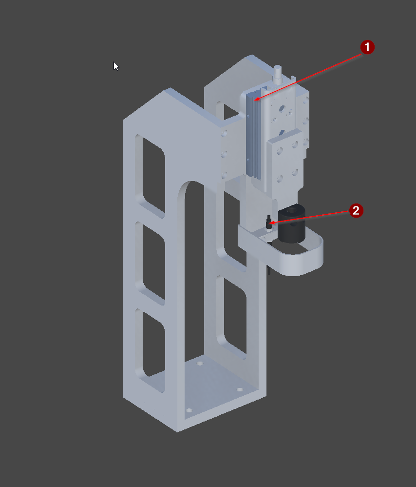

<!-- GENERATED from the Unity twin - do not edit. The build sweeps this directory and deletes anything it did not write; see _workflow/README.md. -->
<!-- Source: Unity/Assets/StreamingAssets/<Scene>_Context.json (structure and prose) and <Scene>_Project_Tree.xml (the device list), for every exported vendor scene. Edit the scene's ContextNodes, then re-run refreshing-project-knowledge. The control side is on the vendor page linked from here. -->

# FG_04

| | |
|---|---|
| Scene path | `Project/FG_04` |
| Twin PLC path | `MAIN.FG_04` |
| Served by | `Index04` (FG_Transport) |
| Symbols | 2 |
| Behaviour | [`fg-04-behaviour.md`](../reference/fg-04-behaviour.md) |

Presses the part home into its slot and checks that it seated correctly.

## Figure



*The FG_04 press station, isolated.*

## Devices

| # | Device | Type | Twin FB | Twin PLC path | What it does |
|---:|---|---|---|---|---|
| 1 | `Y_AxisZ` | [Cylinder](devices/cylinder.md) | `FB_Cylinder` | `MAIN.FG_04.Y_AxisZ` | Press cylinder. Strokes down to seat the part in its slot, holds 1 s, then retracts. |
| 2 | `B_NIO` | [SignalBinary](devices/signalbinary.md) | `FB_SensorBinary` | `MAIN.FG_04.B_NIO` | Not in order signal for the press. PartPressDetector raises it when the press cylinder has reached its bottom limit but the seating sensor sees no part - press completed with nothing correctly seated. |

`#` is the numbered arrow on the figure above.

**The twin path is not the control path.** A control platform spells these devices differently - it may fold a twin child into its parent unit, or address it from another root entirely - and only the control spelling works in a binding or a link, where the twin's fails silently. The verified control path for each row is on the vendor page linked below.

## Bit mapping

_None._

## Hierarchy

The scene tree. The comment on each line is what the node is; `†` marks one that differs between scenes.

```yaml
Y_AxisZ:   # Cylinder
Axis_Z:    # grouping, not a device
B_NIO:     # SignalBinary
  Sensor:  # SensorBinary · simulation only, no PLC
```

## Unity

Twin animation: [`SequenceUnit4.cs`](../../Unity/Assets/Demo_1/Scripts/MIL/SequenceUnit4.cs) — behaviour contract is in [transport-behaviour.md](../reference/transport-behaviour.md)

**Simulation only** - they talk to no PLC at all:

- `Sensor` (SensorBinary)

### Notes

**Y_AxisZ** — `MAIN.FG_04.Y_AxisZ` · Cylinder
- *Signal* — Double solenoid with both limits read. EXTENDED presses down onto the part; retracted is clear. A double solenoid so an abort leaves it where it is.

**Axis_Z** — `` · not a PLC symbol
- *Function* — Kinematic axis carrying the press head down onto the part and back up.
- *Twin* — OC Axis driven by the Y_AxisZ cylinder. The seating verdict does not come from here - PartPressDetector raises B_NIO.

**B_NIO** — `MAIN.FG_04.B_NIO` · SignalBinary
- *Signal* — A VERDICT, not a sensor reading. Active means the press bottomed with nothing correctly seated. Only meaningful at the bottom limit with the hold expired.

**Sensor** — `MAIN.FG_04.Sensor` · SensorBinary · not a PLC symbol
- *Function* — Seating sensor under the press. Detects that a part is present and correctly seated.
- *Signal* — Not a PLC symbol - its Link is disabled. It feeds PartPressDetector locally, which publishes the result to the PLC as B_NIO.

## Control implementations

The twin is master for **structure**, and that is all this page states. The control module, the twin device layer, the verified control PLC paths and the terminal mapping is the control platform's own knowledge base:

- [Beckhoff](https://github.com/Preliy/DT_PSA_OPCV_Beckhoff/blob/master/_docs/context/fg-04.md)
- **Siemens** — _no knowledge base published yet_
