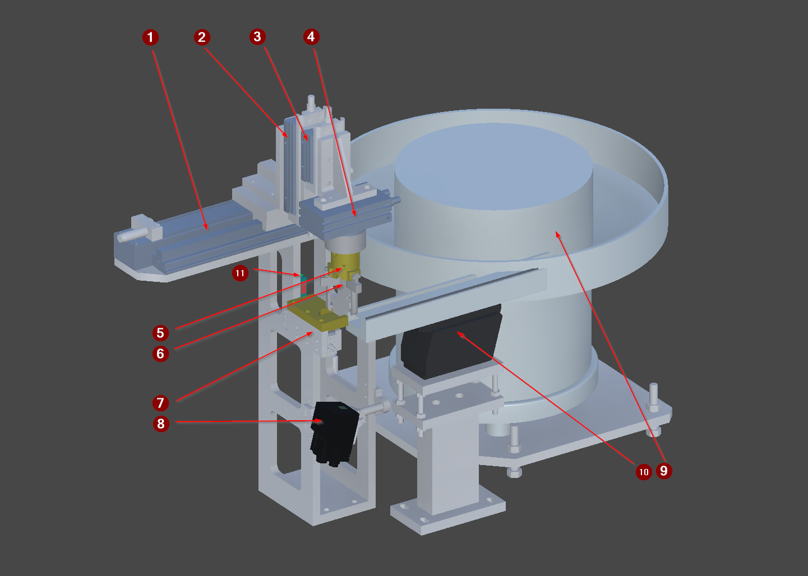

<!-- GENERATED from the Unity twin - do not edit. The build sweeps this directory and deletes anything it did not write; see _workflow/README.md. -->
<!-- Source: Unity/Assets/StreamingAssets/<Scene>_Context.json (structure and prose) and <Scene>_Project_Tree.xml (the device list), for every exported vendor scene. Edit the scene's ContextNodes, then re-run refreshing-project-knowledge. The control side is on the vendor page linked from here. -->

# FG_05

| | |
|---|---|
| Scene path | `Project/FG_05` |
| Twin PLC path | `MAIN.FG_05` |
| Served by | `Index05` (FG_Transport) |
| Symbols | 10 |
| Behaviour | [`fg-05-behaviour.md`](../reference/fg-05-behaviour.md) |

Fits a cap from the bunker onto the part carried on the pallet.

## Figure



*The FG_05 capping station, isolated, with the cap bunker on the left.*

The numbered arrows name the station modules. Each has its own view below, and its devices are in the table further down.

**1** `Y_AxisX` · **2** `Axis_X/Y_AxisZ1` · **3** `Axis_X/Axis_Z1/Y_AxisZ2` · **4** `Axis_X/Axis_Z1/Axis_Z2/Y_AxisR` · **5** `Axis_X/Axis_Z1/Axis_Z2/Axis_R/Y_Gripper` · **6** `Axis_X/Axis_Z1/Axis_Z2/Axis_R/B_Detect` · **7** `Y_CapsSourceStopper` · **8** `P_Camera` · **9** `Y_CapsSource` · **10** `Y_CapsSource/M_Conveyor` · **11** `B_Part`

## Devices

| # | Device | Type | Twin FB | Twin PLC path | What it does |
|---:|---|---|---|---|---|
| 1 | `Y_AxisX` | [Cylinder](devices/cylinder.md) | `FB_Cylinder` | `MAIN.FG_05.Y_AxisX` | Horizontal traverse between the cap pick position and the pallet. |
| 2 | `Y_AxisZ1` | [Cylinder](devices/cylinder.md) | `FB_Cylinder` | `MAIN.FG_05.Y_AxisZ1` | Vertical stroke on the pallet side, lowering the cap onto the part. |
| 3 | `Y_AxisZ2` | [Cylinder](devices/cylinder.md) | `FB_Cylinder` | `MAIN.FG_05.Y_AxisZ2` | Vertical stroke on the bunker side, lowering the gripper to pick a cap. |
| 4 | `Y_AxisR` | [Cylinder](devices/cylinder.md) | `FB_Cylinder` | `MAIN.FG_05.Y_AxisR` | Rotates the cap into its fitting orientation before placement. |
| 5 | `Y_Gripper` | [Cylinder](devices/cylinder.md) | `FB_Cylinder` | `MAIN.FG_05.Y_Gripper` | Gripper that holds the cap from pick through to placement on the part. |
| 6 | `B_Detect` | [SignalBinary](devices/signalbinary.md) | `FB_SensorBinary` | `MAIN.FG_05.B_Detect` | Grip sensor in the jaws of Y_Gripper. Reports whether this unit is carrying a cap - not whether one is available, which is B_Part on the feed. |
| 7 | `Y_CapsSourceStopper` | [Cylinder](devices/cylinder.md) | `FB_Cylinder` | `MAIN.FG_05.Y_CapsSourceStopper` | Stopper on the cap feed conveyor. Holds the next cap at the pick position. |
| 8 | `P_Camera` | [DataReader](devices/datareader.md) | `FB_Camera` | `MAIN.FG_05.P_Camera` | Identification read of the ASSEMBLY on the pallet, not of the cap. Mounted on the feed side, looking across at the pallet; returns the assembly CapsID. |
| 9 | `Y_CapsSource` | [ControlBunker](devices/controlbunker.md) | `FB_DeviceByte` | `MAIN.FG_05.Y_CapsSource` | Cap bunker. Feeds small caps onto the short conveyor that presents them at the pick position. |
| 11 | `B_Part` | [SensorBinary](devices/sensorbinary.md) | `FB_SensorBinary` | `MAIN.FG_05.B_Part` | Presence sensor at the cap pick position. The station waits for this before starting a cycle. |

`#` is the numbered arrow on the figure above.

**The twin path is not the control path.** A control platform spells these devices differently - it may fold a twin child into its parent unit, or address it from another root entirely - and only the control spelling works in a binding or a link, where the twin's fails silently. The verified control path for each row is on the vendor page linked below.

## Bit mapping

`Control` is what the PLC writes and the twin obeys; `Status` is what the twin reports and the PLC reads. Which member a device uses is on its [device type page](devices/).

### `Y_CapsSource` — ControlBunker

| Symbol | Meaning |
|---|---|
| `ControlData.0` | enables the vibration table that feeds the bunker |
| `ControlData.1` | enables the short caps conveyor that carries them to the pick position |

2 of 8 control bits used. The status byte is unused.

### `P_Camera` — DataReader

| Symbol | Meaning |
|---|---|
| `Control.0` | enable |
| `Control.1` | trigger |
| `Status.0` | Ready |
| `Status.1` | Busy |
| `Status.2` | ResultValid |
| `Status.3` | ResultOK |

2 of 8 control bits, 4 of 8 status bits. ResultOK is meaningless unless ResultValid is set. Identical to FG_01 and FG_02.

## Hierarchy

The scene tree. The comment on each line is what the node is; `†` marks one that differs between scenes.

```yaml
Y_AxisX:              # Cylinder
Axis_X:               # grouping, not a device
  Y_AxisZ1:           # Cylinder
  Axis_Z1:            # grouping, not a device
    Y_AxisZ2:         # Cylinder
    Axis_Z2:          # grouping, not a device
      Y_AxisR:        # Cylinder
      Axis_R:         # grouping, not a device
        Y_Gripper:    # Cylinder
          Finger_1:   # grouping, not a device
          Finger_2:   # grouping, not a device
          Finger_3:   # grouping, not a device
          Gripper:    # grouping, not a device
        B_Detect:     # SignalBinary
Axis_Source:          # grouping, not a device
Y_CapsSourceStopper:  # Cylinder
Y_CapsSource:         # ControlBunker
  M_Conveyor:         # grouping, not a device
    Surface:          # grouping, not a device
  Source:             # grouping, not a device
P_Camera:             # DataReader
B_Part:               # SensorBinary
```

## Unity

Twin animation: [`SequenceUnit5.cs`](../../Unity/Assets/Demo_1/Scripts/MIL/SequenceUnit5.cs), [`SequenceBunker.cs`](../../Unity/Assets/Demo_1/Scripts/MIL/SequenceBunker.cs) — behaviour contract is in [transport-behaviour.md](../reference/transport-behaviour.md)

### Notes

**Y_AxisX** — `MAIN.FG_05.Y_AxisX` · Cylinder
- *Signal* — Double solenoid with both limits read. MAX is over the pallet, min is over the cap feed.

**Axis_X** — `MAIN.FG_05.Axis_X` · not a PLC symbol
- *Function* — Kinematic joint of the cap handling unit, driven by the matching Y_ cylinder. Carries motion only and is not a PLC device in its own right.

**Y_AxisZ1** — `MAIN.FG_05.Y_AxisZ1` · Cylinder
- *Signal* — Double solenoid with both limits read. EXTENDED lowers the cap onto the part on the pallet side.

**Axis_Z1** — `MAIN.FG_05.Axis_Z1` · not a PLC symbol
- *Function* — Kinematic joint of the cap handling unit, driven by the matching Y_ cylinder. Carries motion only and is not a PLC device in its own right.

**Y_AxisZ2** — `MAIN.FG_05.Y_AxisZ2` · Cylinder
- *Signal* — Double solenoid with both limits read. EXTENDED lowers to the cap at the pick position on the feed side.

**Axis_Z2** — `MAIN.FG_05.Axis_Z2` · not a PLC symbol
- *Function* — Kinematic joint of the cap handling unit, driven by the matching Y_ cylinder. Carries motion only and is not a PLC device in its own right.

**Y_AxisR** — `MAIN.FG_05.Y_AxisR` · Cylinder
- *Signal* — Double solenoid with both limits read. Rotary. Extended is the fitting orientation, retracted is home.

**Axis_R** — `MAIN.FG_05.Axis_R` · not a PLC symbol
- *Function* — Kinematic joint of the cap handling unit, driven by the matching Y_ cylinder. Carries motion only and is not a PLC device in its own right.

**Y_Gripper** — `MAIN.FG_05.Y_Gripper` · Cylinder
- *Signal* — Double solenoid with both limits read. EXTENDED grips the cap. The limit proves the jaws moved, NOT that they caught one - only B_Detect says that.

**Finger_1** — `` · not a PLC symbol
- *Function* — One jaw of a three-finger gripper. Cosmetic kinematics only.
- *Twin* — OC Axis driven by the gripper cylinder. Carries no payload itself - the Gripper sibling holds it.

**Finger_2** — `` · not a PLC symbol
- *Function* — One jaw of a three-finger gripper. Cosmetic kinematics only.
- *Twin* — OC Axis driven by the gripper cylinder. Carries no payload itself - the Gripper sibling holds it.

**Finger_3** — `` · not a PLC symbol
- *Function* — One jaw of a three-finger gripper. Cosmetic kinematics only.
- *Twin* — OC Axis driven by the gripper cylinder. Carries no payload itself - the Gripper sibling holds it.

**Gripper** — `` · not a PLC symbol
- *Function* — Payload carrier for the cap handling unit. Holds one cap from the feed to the part.
- *Twin* — OC Gripper on a Rigidbody. The parent Cylinder's events drive it: OnLimitMax calls Pick, OnLimitMin calls Place, and OnActiveChanged calls Place(IsActive). Carries Snapping too, which the FG_03 grippers do not.
- *Approximation* — Snapping aligns the cap to a fixed pose on pick, so placement is always repeatable. A real gripper would inherit whatever pose the cap arrived in.
- *Caution* — Cylinder.IsActive means MOVING and Place(true) releases, so ANY drift off the max limit drops the payload. A de-energised double solenoid does NOT hold it here.

**B_Detect** — `MAIN.FG_05.B_Detect` · SignalBinary
- *Signal* — Grip witness in the jaws. Active while this unit carries a cap. NOT the same question as B_Part.

**Axis_Source** — `` · not a PLC symbol
- *Function* — Kinematic axis positioning the cap feed relative to the handling unit.
- *Twin* — OC Axis. Static during operation - nothing in the PLC commands it.

**Y_CapsSourceStopper** — `MAIN.FG_05.Y_CapsSourceStopper` · Cylinder
- *Signal* — Double solenoid with both limits read. EXTENDED BLOCKS the feed path and the queue accumulates against it. The opposite sense to a transport stopper.

**Y_CapsSource** — `MAIN.FG_05.Y_CapsSource` · ControlBunker
- *Signal* — Two bool outputs from the PLC and no status bits - the bunker reports nothing back. MIL turns both on together for as long as it is enabled.

**M_Conveyor** — `` · not a PLC symbol
- *Function* — Transform grouping for the cap feed belt. Carries no OC component itself; the driven Surface is its child.
- *Twin* — Unity grouping only - no Hierarchy, so it opens no level in the PLC path.

**Surface** — `` · not a PLC symbol
- *Function* — The cap feed belt, running continuously to push caps up to the pick position.
- *Twin* — TransportLinear on a Rigidbody, from the Source Unit Caps prefab.
- *Caution* — The feed is NOT part of the pallet cycle. It is commanded on mode and state only; driven from a station sequence it would stop between pallets and no cap would ever be waiting.

**Source** — `` · not a PLC symbol
- *Function* — Spawns cap payloads onto the feed belt.
- *Twin* — OC Source (a Detector) with Create() / Delete(), carrying _typeId and _uniqueId. Spawns on its own schedule, not on a PLC command.
- *Approximation* — The bunker is modelled as an infinite supply. There is no level sensor, no empty state and nothing the PLC could read to know it has run out.

**P_Camera** — `MAIN.FG_05.P_Camera` · DataReader
- *Signal* — Enable, then trigger; reads back Ready, Busy, ResultValid and ResultOK. The twin echoes the two control bits and hands over the datum; the verdict is synthesised in OC_SIM FB_Camera.

**B_Part** — `MAIN.FG_05.B_Part` · SensorBinary
- *Signal* — Binary presence sensor. On the FEED: a cap has arrived at the pick position. Once the gripper lifts one away it reports the NEXT one.

## Control implementations

The twin is master for **structure**, and that is all this page states. The control module, the twin device layer, the verified control PLC paths and the terminal mapping is the control platform's own knowledge base:

- [Beckhoff](https://github.com/Preliy/DT_PSA_OPCV_Beckhoff/blob/master/_docs/context/fg-05.md)
- **Siemens** — _no knowledge base published yet_
