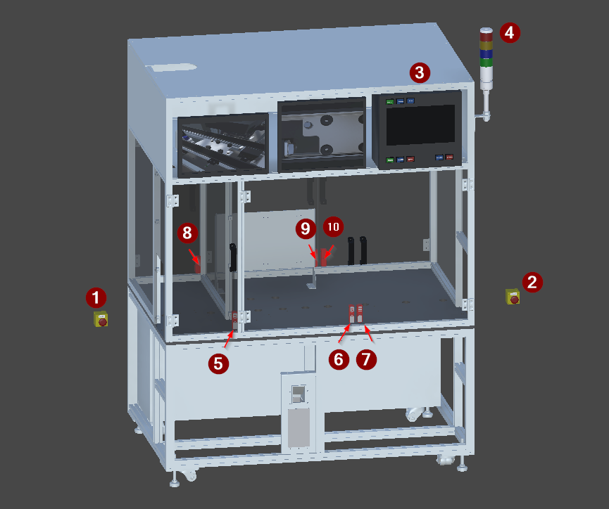

<!-- GENERATED from the Unity twin - do not edit. The build sweeps this directory and deletes anything it did not write; see _workflow/README.md. -->
<!-- Source: Unity/Assets/StreamingAssets/<Scene>_Context.json (structure and prose) and <Scene>_Project_Tree.xml (the device list), for every exported vendor scene. Edit the scene's ContextNodes, then re-run refreshing-project-knowledge. The control side is on the vendor page linked from here. -->

# FG_System

| | |
|---|---|
| Scene path | `Project/FG_System` |
| Twin PLC path | `MAIN.FG_System` |
| Served by | — |
| Symbols | 10 |
| Behaviour | [`fg-system-safety.md`](../reference/fg-system-safety.md) |

Cell infrastructure - safety enclosure, interlocked doors, operator panel, signal tower and monitors. Carries no part processing of its own.

> **Not every scene has this group's operator panel.** 9 node(s) below are marked † because they come from the reference scene `VC_Demo_1_Beckhoff_1` and another scene spells them differently. Read them as an example of a vendor panel, not as the machine's. Each vendor's own is on its page at the bottom of this one.

## Figure



*The FG_System group and the machine main frame, isolated.*

## Devices

| # | Device | Type | Twin FB | Twin PLC path | What it does |
|---:|---|---|---|---|---|
| 1 | `SS_EStop1` | [Button](devices/button.md) | `FB_Button` | `MAIN.FG_System.SS_EStop1` | Emergency stop, position 1. Latching mushroom actuator that drops the cell to a safe state. |
| 2 | `SS_EStop2` | [Button](devices/button.md) | `FB_Button` | `MAIN.FG_System.SS_EStop2` | Emergency stop, position 2. Latching mushroom actuator that drops the cell to a safe state. |
| 3 | `H_ControlPanel` † | [PanelSampler](devices/panelsampler.md) | `FB_Panel` | `MAIN.FG_System.H_ControlPanel` | Main operator panel, TwinCAT/Beckhoff variant. Samples eight push buttons - five PackML machine commands and three mode selections - into one PLC symbol, and lights each button back from it. |
| 4 | `H_SignalTower` | [PanelSampler](devices/panelsampler.md) | `FB_Panel` | `MAIN.FG_System.H_SignalTower` | Four colour signal tower. Samples its red, yellow, blue and green lamps into one PLC symbol. |
| 5 | `B_SafetyDoor11` | [Lock](devices/lock.md) | `FB_Lock` | `MAIN.FG_System.B_SafetyDoor11` | Safety interlock on an enclosure door, side 1. Reports door position and holds the door locked while the cell may move. |
| 6 | `B_SafetyDoor12` | [Lock](devices/lock.md) | `FB_Lock` | `MAIN.FG_System.B_SafetyDoor12` | Safety interlock on an enclosure door, side 1. Reports door position and holds the door locked while the cell may move. |
| 7 | `B_SafetyDoor13` | [Lock](devices/lock.md) | `FB_Lock` | `MAIN.FG_System.B_SafetyDoor13` | Safety interlock on an enclosure door, side 1. Reports door position and holds the door locked while the cell may move. |
| 8 | `B_SafetyDoor21` | [Lock](devices/lock.md) | `FB_Lock` | `MAIN.FG_System.B_SafetyDoor21` | Safety interlock on an enclosure door, side 2. Reports door position and holds the door locked while the cell may move. |
| 9 | `B_SafetyDoor22` | [Lock](devices/lock.md) | `FB_Lock` | `MAIN.FG_System.B_SafetyDoor22` | Safety interlock on an enclosure door, side 2. Reports door position and holds the door locked while the cell may move. |
| 10 | `B_SafetyDoor23` | [Lock](devices/lock.md) | `FB_Lock` | `MAIN.FG_System.B_SafetyDoor23` | Safety interlock on an enclosure door, side 2. Reports door position and holds the door locked while the cell may move. |

`#` is the numbered arrow on the figure above.

† **From the reference scene only.** Every scene instances the same `Machine_1` prefab, but each adds its own vendor's operator panel, so this row is `VC_Demo_1_Beckhoff_1`'s and another scene spells it differently. The machine is what is *un*marked; a marked row is an example. Each vendor's own is on its page below.

**The twin path is not the control path.** A control platform spells these devices differently - it may fold a twin child into its parent unit, or address it from another root entirely - and only the control spelling works in a binding or a link, where the twin's fails silently. The verified control path for each row is on the vendor page linked below.

## Bit mapping

`Control` is what the PLC writes and the twin obeys; `Status` is what the twin reports and the PLC reads. Which member a device uses is on its [device type page](devices/).

### `H_SignalTower` — PanelSampler

| Signal | Type | The PLC reads | The PLC writes | What it is |
|---|---|---|---|---|
| `RED` | [Lamp](devices/lamp.md) | — | `ControlData.0` | Assumed from the colour, not confirmed by code: fault or stopped. |
| `YELLOW` | [Lamp](devices/lamp.md) | — | `ControlData.1` | Assumed from the colour, not confirmed by code: warning, or ready and waiting. |
| `BLUE` | [Lamp](devices/lamp.md) | — | `ControlData.2` | Signal tower lamp segment. Its meaning is given by the Role entry. |
| `GREEN` | [Lamp](devices/lamp.md) | — | `ControlData.3` | Assumed from the colour, not confirmed by code: running normally. |

Verified 2026-08-20 from the live PanelSampler _components list, 4 bits used of 32. Lamps are outputs only - the PLC drives them through ControlData; StatusData is unused. Order follows the _components list - reordering it changes the PLC bit assignment.

### `H_ControlPanel` † — PanelSampler

| Signal | Type | The PLC reads | The PLC writes |
|---|---|---|---|
| `START` | [Button](devices/button.md) | `StatusData.0` | `ControlData.0` |
| `RESET` | [Button](devices/button.md) | `StatusData.1` | `ControlData.1` |
| `STOP` | [Button](devices/button.md) | `StatusData.2` | `ControlData.2` |
| `CLEAR` | [Button](devices/button.md) | `StatusData.3` | `ControlData.3` |
| `ABORT` | [Button](devices/button.md) | `StatusData.4` | `ControlData.4` |
| `PRODUCTION` | [Button](devices/button.md) | `StatusData.5` | `ControlData.5` |
| `MAINTANANCE` | [Button](devices/button.md) | `StatusData.6` | `ControlData.6` |
| `MANUAL` | [Button](devices/button.md) | `StatusData.7` | `ControlData.7` |

8 of 32 bits used. StatusData carries the pressed state in, ControlData drives each button's lamp at the same bit. Order follows the PanelSampler _components list.

## Hierarchy

The scene tree. The comment on each line is what the node is; `†` marks one that differs between scenes.

```yaml
Doors:             # grouping, not a device
  B_SafetyDoor11:  # Lock
  B_SafetyDoor12:  # Lock
  B_SafetyDoor13:  # Lock
  B_SafetyDoor21:  # Lock
  B_SafetyDoor22:  # Lock
  B_SafetyDoor23:  # Lock
H_SignalTower:     # PanelSampler
  RED:             # Lamp · a bit inside H_SignalTower
  YELLOW:          # Lamp · a bit inside H_SignalTower
  BLUE:            # Lamp · a bit inside H_SignalTower
  GREEN:           # Lamp · a bit inside H_SignalTower
H_ControlPanel:    # PanelSampler †
  START:           # Button · a bit inside H_ControlPanel †
  RESET:           # Button · a bit inside H_ControlPanel †
  STOP:            # Button · a bit inside H_ControlPanel †
  CLEAR:           # Button · a bit inside H_ControlPanel †
  ABORT:           # Button · a bit inside H_ControlPanel †
  PRODUCTION:      # Button · a bit inside H_ControlPanel †
  MAINTANANCE:     # Button · a bit inside H_ControlPanel †
  MANUAL:          # Button · a bit inside H_ControlPanel †
SS_EStop1:         # Button
SS_EStop2:         # Button
```

## Unity

**Aggregated** - bits inside a `FB_Panel`, not devices of their own. Do not generate code for these:

- `RED` (Lamp) → `H_SignalTower`
- `YELLOW` (Lamp) → `H_SignalTower`
- `BLUE` (Lamp) → `H_SignalTower`
- `GREEN` (Lamp) → `H_SignalTower`
- `START` † (Button) → `H_ControlPanel`
- `RESET` † (Button) → `H_ControlPanel`
- `STOP` † (Button) → `H_ControlPanel`
- `CLEAR` † (Button) → `H_ControlPanel`
- `ABORT` † (Button) → `H_ControlPanel`
- `PRODUCTION` † (Button) → `H_ControlPanel`
- `MAINTANANCE` † (Button) → `H_ControlPanel`
- `MANUAL` † (Button) → `H_ControlPanel`

### Notes

**Doors** — `MAIN.FG_System.Doors` · not a PLC symbol
- *Function* — Enclosure doors and their safety locks. Three doors on each of the two accessible sides.

**B_SafetyDoor11** — `MAIN.FG_System.B_SafetyDoor11` · Lock
- *Signal* — Two inputs back - closed and locked - and one lock coil out. Secure means BOTH: closed alone is not enough.

**B_SafetyDoor12** — `MAIN.FG_System.B_SafetyDoor12` · Lock
- *Signal* — Two inputs back - closed and locked - and one lock coil out. Secure means BOTH: closed alone is not enough.

**B_SafetyDoor13** — `MAIN.FG_System.B_SafetyDoor13` · Lock
- *Signal* — Two inputs back - closed and locked - and one lock coil out. Secure means BOTH: closed alone is not enough.

**B_SafetyDoor21** — `MAIN.FG_System.B_SafetyDoor21` · Lock
- *Signal* — Two inputs back - closed and locked - and one lock coil out. Secure means BOTH: closed alone is not enough.

**B_SafetyDoor22** — `MAIN.FG_System.B_SafetyDoor22` · Lock
- *Signal* — Two inputs back - closed and locked - and one lock coil out. Secure means BOTH: closed alone is not enough.

**B_SafetyDoor23** — `MAIN.FG_System.B_SafetyDoor23` · Lock
- *Signal* — Two inputs back - closed and locked - and one lock coil out. Secure means BOTH: closed alone is not enough.

**H_SignalTower** — `MAIN.FG_System.H_SignalTower` · PanelSampler
- *Signal* — PanelSampler. Aggregates the four tower lamps into one FB_Panel DWORD, with the lamps own links disabled. Same packing mechanism as the control panel.

**RED** — `MAIN.FG_System.RED` · Lamp · not a PLC symbol
- *Function* — Signal tower lamp segment. Its meaning is given by the Role entry on each instance.
- *Role* — Assumed from the colour, not confirmed by code: fault or stopped.
- *Signal* — Not a PLC symbol in its own right - its own Link is disabled by the PanelSampler. Reached as bit 0 of the H_SignalTower FB_Panel DWORD.

**YELLOW** — `MAIN.FG_System.YELLOW` · Lamp · not a PLC symbol
- *Function* — Signal tower lamp segment. Its meaning is given by the Role entry.
- *Role* — Assumed from the colour, not confirmed by code: warning, or ready and waiting.
- *Signal* — Not a PLC symbol in its own right - its own Link is disabled by the PanelSampler. Reached as bit 1 of the H_SignalTower FB_Panel DWORD.

**BLUE** — `MAIN.FG_System.BLUE` · Lamp · not a PLC symbol
- *Function* — Signal tower lamp segment. Its meaning is given by the Role entry.
- *Signal* — Not a PLC symbol in its own right - its own Link is disabled by the PanelSampler. Reached as bit 2 of the H_SignalTower FB_Panel DWORD.

**GREEN** — `MAIN.FG_System.GREEN` · Lamp · not a PLC symbol
- *Function* — Signal tower lamp segment. Its meaning is given by the Role entry.
- *Role* — Assumed from the colour, not confirmed by code: running normally.
- *Signal* — Not a PLC symbol in its own right - its own Link is disabled by the PanelSampler. Reached as bit 3 of the H_SignalTower FB_Panel DWORD.

**H_ControlPanel** † — `MAIN.FG_System.H_ControlPanel` · PanelSampler
- *Signal* — PanelSampler. Disables its children's individual communication and exposes one aggregated FB_Panel DWORD, packing their status bits in and unpacking control bits back.

**START** † — `MAIN.FG_System.START` · Button · not a PLC symbol
- *Signal* — Not a PLC symbol in its own right - its own Link is disabled by the PanelSampler. Pressed state is bit 0 of the H_ControlPanel FB_Panel StatusData; its feedback lamp is bit 0 of ControlData.

**RESET** † — `MAIN.FG_System.RESET` · Button · not a PLC symbol
- *Signal* — Not a PLC symbol in its own right - its own Link is disabled by the PanelSampler. Pressed state is bit 1 of the H_ControlPanel FB_Panel StatusData; its feedback lamp is bit 1 of ControlData.

**STOP** † — `MAIN.FG_System.STOP` · Button · not a PLC symbol
- *Signal* — Not a PLC symbol in its own right - its own Link is disabled by the PanelSampler. Pressed state is bit 2 of the H_ControlPanel FB_Panel StatusData; its feedback lamp is bit 2 of ControlData.

**CLEAR** † — `MAIN.FG_System.CLEAR` · Button · not a PLC symbol
- *Signal* — Not a PLC symbol in its own right - its own Link is disabled by the PanelSampler. Pressed state is bit 3 of the H_ControlPanel FB_Panel StatusData; its feedback lamp is bit 3 of ControlData.

**ABORT** † — `MAIN.FG_System.ABORT` · Button · not a PLC symbol
- *Signal* — Not a PLC symbol in its own right - its own Link is disabled by the PanelSampler. Pressed state is bit 4 of the H_ControlPanel FB_Panel StatusData; its feedback lamp is bit 4 of ControlData.

**PRODUCTION** † — `MAIN.FG_System.PRODUCTION` · Button · not a PLC symbol
- *Signal* — Not a PLC symbol in its own right - its own Link is disabled by the PanelSampler. Pressed state is bit 5 of the H_ControlPanel FB_Panel StatusData; its feedback lamp is bit 5 of ControlData.

**MAINTANANCE** † — `MAIN.FG_System.MAINTANANCE` · Button · not a PLC symbol
- *Signal* — Not a PLC symbol in its own right - its own Link is disabled by the PanelSampler. Pressed state is bit 6 of the H_ControlPanel FB_Panel StatusData; its feedback lamp is bit 6 of ControlData.

**MANUAL** † — `MAIN.FG_System.MANUAL` · Button · not a PLC symbol
- *Signal* — Not a PLC symbol in its own right - its own Link is disabled by the PanelSampler. Pressed state is bit 7 of the H_ControlPanel FB_Panel StatusData; its feedback lamp is bit 7 of ControlData.

**SS_EStop1** — `MAIN.FG_System.SS_EStop1` · Button
- *Signal* — One input and one lamp coil, as a single device. Active while the mushroom is latched.

**SS_EStop2** — `MAIN.FG_System.SS_EStop2` · Button
- *Signal* — One input and one lamp coil, as a single device. Active while the mushroom is latched.

## Control implementations

The twin is master for **structure**, and that is all this page states. The control module, the twin device layer, the verified control PLC paths and the terminal mapping is the control platform's own knowledge base:

- [Beckhoff](https://github.com/Preliy/DT_PSA_OPCV_Beckhoff/blob/master/_docs/context/fg-system.md)
- **Siemens** — _no knowledge base published yet_
