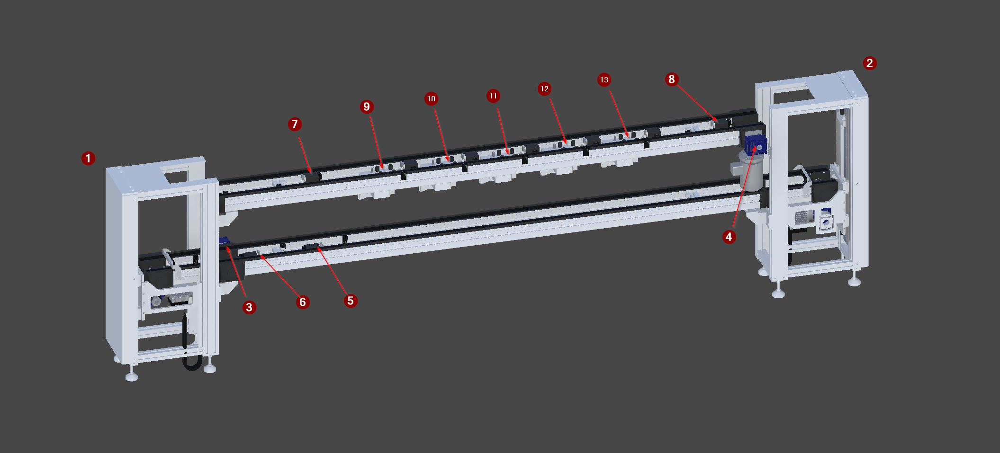
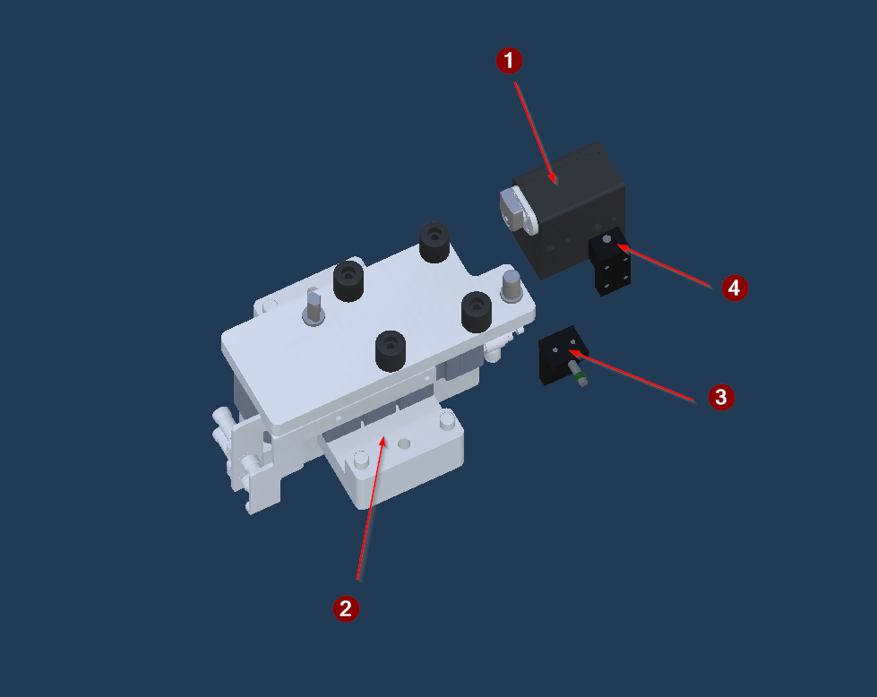
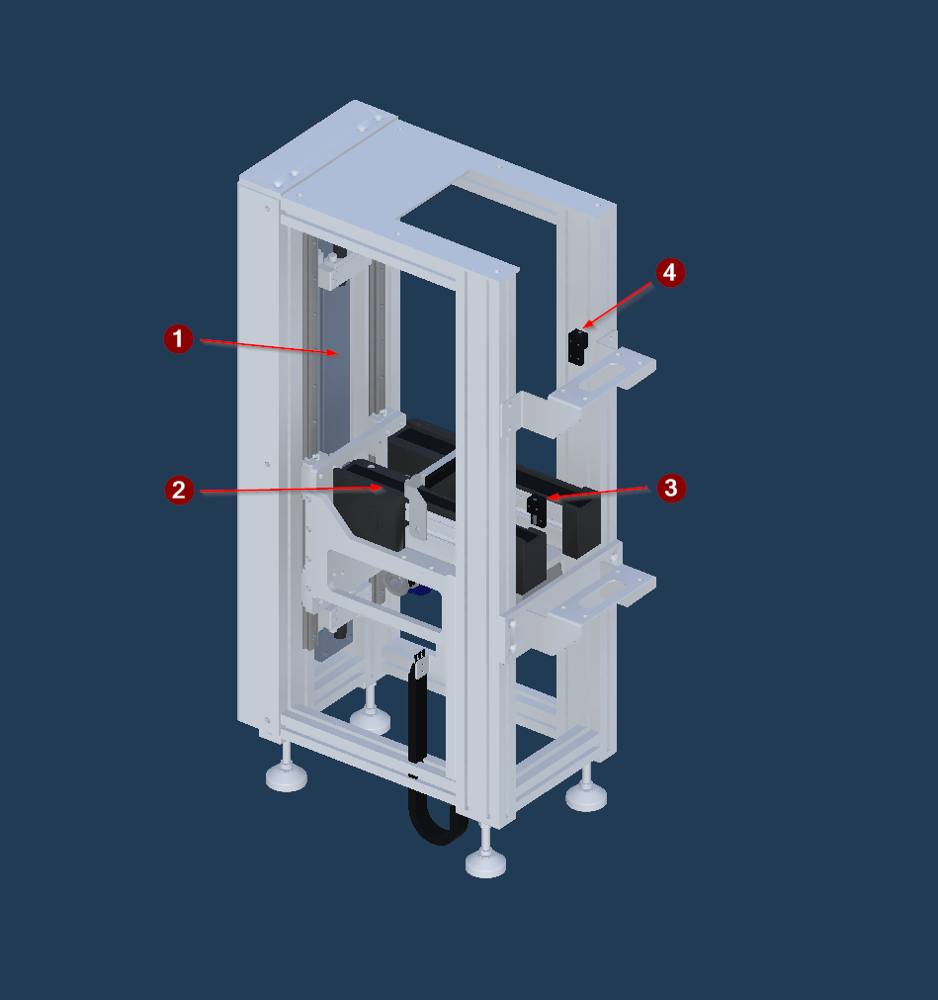
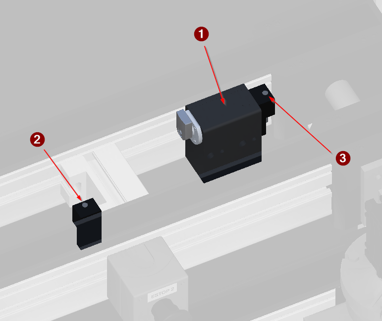

<!-- GENERATED from the Unity twin - do not edit. The build sweeps this directory and deletes anything it did not write; see _workflow/README.md. -->
<!-- Source: Unity/Assets/StreamingAssets/<Scene>_Context.json (structure and prose) and <Scene>_Project_Tree.xml (the device list), for every exported vendor scene. Edit the scene's ContextNodes, then re-run refreshing-project-knowledge. The control side is on the vendor page linked from here. -->

# FG_Transport

| | |
|---|---|
| Scene path | `Project/FG_Transport` |
| Twin PLC path | `MAIN.FG_Transport` |
| Served by | — |
| Symbols | 42 |
| Behaviour | [`transport-behaviour.md`](../reference/transport-behaviour.md) |

Two level pallet conveyor in the Bosch TS style. Circulates pallets past the five processing stations and returns them.

## Figure



*The two level pallet conveyor, isolated. Callouts name the transport modules; each module type has its own detail view below.*

The numbered arrows name the station modules. Each has its own view below, and its devices are in the table further down.

**1** [`Lift01`](#modul-lift-overview) · **2** [`Lift02`](#modul-lift-overview) · **3** `Transport01/M_Conveyor` · **4** `Transport02/M_Conveyor` · **5** [`Stopper01`](#modul-stopper-overview) · **6** [`Stopper02`](#modul-stopper-overview) · **7** [`Stopper03`](#modul-stopper-overview) · **8** [`Stopper04`](#modul-stopper-overview) · **9** [`Index01`](#modul-index-overview) · **10** [`Index02`](#modul-index-overview) · **11** [`Index03`](#modul-index-overview) · **12** [`Index04`](#modul-index-overview) · **13** [`Index05`](#modul-index-overview)

## Station modules

Each module type below is a prefab instanced several times in this group. The figure is rendered from one instance and states which others it stands for - a claim the build checks, by comparing their devices.

### Index module

<a id="modul-index-overview"></a>



*The index module, isolated. Stops a pallet and lifts it to fix the payload while its functional group runs.*

Rendered from `Index01`. Stands for `Index01`, `Index02`, `Index03`, `Index04`, `Index05`. Its devices carry the callout number in the table below.

### Lift module

<a id="modul-lift-overview"></a>



*The lift module, isolated. Raises or lowers a pallet between the two conveyor levels and runs it off the carriage.*

Rendered from `Lift01`. Stands for `Lift01`, `Lift02`. Its devices carry the callout number in the table below.

### Stopper module

<a id="modul-stopper-overview"></a>



*The stopper module, isolated. Holds and releases a pallet without lifting it.*

Rendered from `Stopper01`. Stands for `Stopper01`, `Stopper02`, `Stopper03`, `Stopper04`. Its devices carry the callout number in the table below.

## Devices

| # | Device | Type | Twin FB | Twin PLC path | What it does |
|---:|---|---|---|---|---|
| [3](#modul-index-overview) | `B_Detect` | [SensorBinary](devices/sensorbinary.md) | `FB_SensorBinary` | `MAIN.FG_Transport.Index01_B_Detect` | Presence sensor at the stop position. Tells the unit a pallet has arrived and is ready to be indexed. |
| [4](#modul-index-overview) | `B_Exit` | [SensorBinary](devices/sensorbinary.md) | `FB_SensorBinary` | `MAIN.FG_Transport.Index01_B_Exit` | Exit sensor just past the stopper. Confirms the released pallet has actually left before the unit returns to idle. |
| [2](#modul-index-overview) | `Y_Lift` | [Cylinder](devices/cylinder.md) | `FB_Cylinder` | `MAIN.FG_Transport.Index01_Y_Lift` | Index lift cylinder. Raises the pallet off the conveyor to a repeatable position and fixes the payload while the station works on it. |
| [1](#modul-index-overview) | `Y_Stopper` | [Cylinder](devices/cylinder.md) | `FB_Cylinder` | `MAIN.FG_Transport.Index01_Y_Stopper` | Stopper cylinder. Retracted holds an incoming pallet at the station; extending releases it once the next station is free. |
| [3](#modul-index-overview) | `B_Detect` | [SensorBinary](devices/sensorbinary.md) | `FB_SensorBinary` | `MAIN.FG_Transport.Index02_B_Detect` | Presence sensor at the stop position. Tells the unit a pallet has arrived and is ready to be indexed. |
| [4](#modul-index-overview) | `B_Exit` | [SensorBinary](devices/sensorbinary.md) | `FB_SensorBinary` | `MAIN.FG_Transport.Index02_B_Exit` | Exit sensor just past the stopper. Confirms the released pallet has actually left before the unit returns to idle. |
| [2](#modul-index-overview) | `Y_Lift` | [Cylinder](devices/cylinder.md) | `FB_Cylinder` | `MAIN.FG_Transport.Index02_Y_Lift` | Index lift cylinder. Raises the pallet off the conveyor to a repeatable position and fixes the payload while the station works on it. |
| [1](#modul-index-overview) | `Y_Stopper` | [Cylinder](devices/cylinder.md) | `FB_Cylinder` | `MAIN.FG_Transport.Index02_Y_Stopper` | Stopper cylinder. Retracted holds an incoming pallet at the station; extending releases it once the next station is free. |
| [3](#modul-index-overview) | `B_Detect` | [SensorBinary](devices/sensorbinary.md) | `FB_SensorBinary` | `MAIN.FG_Transport.Index03_B_Detect` | Presence sensor at the stop position. Tells the unit a pallet has arrived and is ready to be indexed. |
| [4](#modul-index-overview) | `B_Exit` | [SensorBinary](devices/sensorbinary.md) | `FB_SensorBinary` | `MAIN.FG_Transport.Index03_B_Exit` | Exit sensor just past the stopper. Confirms the released pallet has actually left before the unit returns to idle. |
| [2](#modul-index-overview) | `Y_Lift` | [Cylinder](devices/cylinder.md) | `FB_Cylinder` | `MAIN.FG_Transport.Index03_Y_Lift` | Index lift cylinder. Raises the pallet off the conveyor to a repeatable position and fixes the payload while the station works on it. |
| [1](#modul-index-overview) | `Y_Stopper` | [Cylinder](devices/cylinder.md) | `FB_Cylinder` | `MAIN.FG_Transport.Index03_Y_Stopper` | Stopper cylinder. Retracted holds an incoming pallet at the station; extending releases it once the next station is free. |
| [3](#modul-index-overview) | `B_Detect` | [SensorBinary](devices/sensorbinary.md) | `FB_SensorBinary` | `MAIN.FG_Transport.Index04_B_Detect` | Presence sensor at the stop position. Tells the unit a pallet has arrived and is ready to be indexed. |
| [4](#modul-index-overview) | `B_Exit` | [SensorBinary](devices/sensorbinary.md) | `FB_SensorBinary` | `MAIN.FG_Transport.Index04_B_Exit` | Exit sensor just past the stopper. Confirms the released pallet has actually left before the unit returns to idle. |
| [2](#modul-index-overview) | `Y_Lift` | [Cylinder](devices/cylinder.md) | `FB_Cylinder` | `MAIN.FG_Transport.Index04_Y_Lift` | Index lift cylinder. Raises the pallet off the conveyor to a repeatable position and fixes the payload while the station works on it. |
| [1](#modul-index-overview) | `Y_Stopper` | [Cylinder](devices/cylinder.md) | `FB_Cylinder` | `MAIN.FG_Transport.Index04_Y_Stopper` | Stopper cylinder. Retracted holds an incoming pallet at the station; extending releases it once the next station is free. |
| [3](#modul-index-overview) | `B_Detect` | [SensorBinary](devices/sensorbinary.md) | `FB_SensorBinary` | `MAIN.FG_Transport.Index05_B_Detect` | Presence sensor at the stop position. Tells the unit a pallet has arrived and is ready to be indexed. |
| [4](#modul-index-overview) | `B_Exit` | [SensorBinary](devices/sensorbinary.md) | `FB_SensorBinary` | `MAIN.FG_Transport.Index05_B_Exit` | Exit sensor just past the stopper. Confirms the released pallet has actually left before the unit returns to idle. |
| [2](#modul-index-overview) | `Y_Lift` | [Cylinder](devices/cylinder.md) | `FB_Cylinder` | `MAIN.FG_Transport.Index05_Y_Lift` | Index lift cylinder. Raises the pallet off the conveyor to a repeatable position and fixes the payload while the station works on it. |
| [1](#modul-index-overview) | `Y_Stopper` | [Cylinder](devices/cylinder.md) | `FB_Cylinder` | `MAIN.FG_Transport.Index05_Y_Stopper` | Stopper cylinder. Retracted holds an incoming pallet at the station; extending releases it once the next station is free. |
| [3](#modul-lift-overview) | `B_Detect` | [SensorBinary](devices/sensorbinary.md) | `FB_SensorBinary` | `MAIN.FG_Transport.Lift01_B_Detect` | Presence sensor on the lift carriage. Confirms a pallet is aboard before the carriage moves. |
| [4](#modul-lift-overview) | `B_Exit` | [SensorBinary](devices/sensorbinary.md) | `FB_SensorBinary` | `MAIN.FG_Transport.Lift01_B_Exit` | Exit sensor on the lift. Confirms the pallet has transferred off the carriage. |
| [2](#modul-lift-overview) | `M_Conveyor` | [DriveSimple](devices/drivesimple.md) | `FB_Drive` | `MAIN.FG_Transport.Lift01_M_Conveyor` | Drive for the conveyor section on the lift carriage. |
| [1](#modul-lift-overview) | `Y_Lift` | [Cylinder](devices/cylinder.md) | `FB_Cylinder` | `MAIN.FG_Transport.Lift01_Y_Lift` | Lift cylinder. Drives the carriage between the lower and upper conveyor levels. |
| [3](#modul-lift-overview) | `B_Detect` | [SensorBinary](devices/sensorbinary.md) | `FB_SensorBinary` | `MAIN.FG_Transport.Lift02_B_Detect` | Presence sensor on the lift carriage. Confirms a pallet is aboard before the carriage moves. |
| [4](#modul-lift-overview) | `B_Exit` | [SensorBinary](devices/sensorbinary.md) | `FB_SensorBinary` | `MAIN.FG_Transport.Lift02_B_Exit` | Exit sensor on the lift. Confirms the pallet has transferred off the carriage. |
| [2](#modul-lift-overview) | `M_Conveyor` | [DriveSimple](devices/drivesimple.md) | `FB_Drive` | `MAIN.FG_Transport.Lift02_M_Conveyor` | Drive for the conveyor section on the lift carriage. |
| [1](#modul-lift-overview) | `Y_Lift` | [Cylinder](devices/cylinder.md) | `FB_Cylinder` | `MAIN.FG_Transport.Lift02_Y_Lift` | Lift cylinder. Drives the carriage between the lower and upper conveyor levels. |
| [2](#modul-stopper-overview) | `B_Detect` | [SensorBinary](devices/sensorbinary.md) | `FB_SensorBinary` | `MAIN.FG_Transport.Stopper01_B_Detect` | Presence sensor at the stop position. Tells the unit a pallet is waiting. |
| [3](#modul-stopper-overview) | `B_Exit` | [SensorBinary](devices/sensorbinary.md) | `FB_SensorBinary` | `MAIN.FG_Transport.Stopper01_B_Exit` | Exit sensor past the stopper. Confirms the released pallet has left before the unit accepts the next one. |
| [1](#modul-stopper-overview) | `Y_Stopper` | [Cylinder](devices/cylinder.md) | `FB_Cylinder` | `MAIN.FG_Transport.Stopper01_Y_Stopper` | Stopper cylinder. Retracted holds the pallet at this accumulation point; extending releases it when the next position is free. |
| [2](#modul-stopper-overview) | `B_Detect` | [SensorBinary](devices/sensorbinary.md) | `FB_SensorBinary` | `MAIN.FG_Transport.Stopper02_B_Detect` | Presence sensor at the stop position. Tells the unit a pallet is waiting. |
| [3](#modul-stopper-overview) | `B_Exit` | [SensorBinary](devices/sensorbinary.md) | `FB_SensorBinary` | `MAIN.FG_Transport.Stopper02_B_Exit` | Exit sensor past the stopper. Confirms the released pallet has left before the unit accepts the next one. |
| [1](#modul-stopper-overview) | `Y_Stopper` | [Cylinder](devices/cylinder.md) | `FB_Cylinder` | `MAIN.FG_Transport.Stopper02_Y_Stopper` | Stopper cylinder. Retracted holds the pallet at this accumulation point; extending releases it when the next position is free. |
| [2](#modul-stopper-overview) | `B_Detect` | [SensorBinary](devices/sensorbinary.md) | `FB_SensorBinary` | `MAIN.FG_Transport.Stopper03_B_Detect` | Presence sensor at the stop position. Tells the unit a pallet is waiting. |
| [3](#modul-stopper-overview) | `B_Exit` | [SensorBinary](devices/sensorbinary.md) | `FB_SensorBinary` | `MAIN.FG_Transport.Stopper03_B_Exit` | Exit sensor past the stopper. Confirms the released pallet has left before the unit accepts the next one. |
| [1](#modul-stopper-overview) | `Y_Stopper` | [Cylinder](devices/cylinder.md) | `FB_Cylinder` | `MAIN.FG_Transport.Stopper03_Y_Stopper` | Stopper cylinder. Retracted holds the pallet at this accumulation point; extending releases it when the next position is free. |
| [2](#modul-stopper-overview) | `B_Detect` | [SensorBinary](devices/sensorbinary.md) | `FB_SensorBinary` | `MAIN.FG_Transport.Stopper04_B_Detect` | Presence sensor at the stop position. Tells the unit a pallet is waiting. |
| [3](#modul-stopper-overview) | `B_Exit` | [SensorBinary](devices/sensorbinary.md) | `FB_SensorBinary` | `MAIN.FG_Transport.Stopper04_B_Exit` | Exit sensor past the stopper. Confirms the released pallet has left before the unit accepts the next one. |
| [1](#modul-stopper-overview) | `Y_Stopper` | [Cylinder](devices/cylinder.md) | `FB_Cylinder` | `MAIN.FG_Transport.Stopper04_Y_Stopper` | Stopper cylinder. Retracted holds the pallet at this accumulation point; extending releases it when the next position is free. |
| 3 | `M_Conveyor` | [DriveSimple](devices/drivesimple.md) | `FB_Drive` | `MAIN.FG_Transport.Transport01_M_Conveyor` | Conveyor drive for a straight transport section. Runs continuously while MIL is enabled. |
| 4 | `M_Conveyor` | [DriveSimple](devices/drivesimple.md) | `FB_Drive` | `MAIN.FG_Transport.Transport02_M_Conveyor` | Conveyor drive for a straight transport section. Runs continuously while MIL is enabled. |

`#` is the numbered arrow on the figure above.

**The twin path is not the control path.** A control platform spells these devices differently - it may fold a twin child into its parent unit, or address it from another root entirely - and only the control spelling works in a binding or a link, where the twin's fails silently. The verified control path for each row is on the vendor page linked below.

## Bit mapping

_None._

## Hierarchy

The scene tree. The comment on each line is what the node is; `†` marks one that differs between scenes.

```yaml
Transport01:       # grouping, not a device
  M_Conveyor:      # DriveSimple
  Surface:         # grouping, not a device
  Source:          # grouping, not a device
  Sink:            # grouping, not a device
Transport02:       # grouping, not a device
  M_Conveyor:      # DriveSimple
  Surface:         # grouping, not a device
Lift01:            # grouping, not a device
  Y_Lift:          # Cylinder
  Axis_Lift:       # grouping, not a device
    TU_Linear:     # grouping, not a device
      M_Conveyor:  # DriveSimple
      Surface:     # grouping, not a device
    B_Detect:      # SensorBinary
  B_Exit:          # SensorBinary
Lift02:            # grouping, not a device
  Y_Lift:          # Cylinder
  Axis_Lift:       # grouping, not a device
    TU_Linear:     # grouping, not a device
      M_Conveyor:  # DriveSimple
      Surface:     # grouping, not a device
    B_Detect:      # SensorBinary
  B_Exit:          # SensorBinary
Index01:           # grouping, not a device
  Y_Stopper:       # Cylinder
    Axis:          # grouping, not a device
  Y_Lift:          # Cylinder
  Axis:            # grouping, not a device
    Surface:       # grouping, not a device
  B_Detect:        # SensorBinary
  B_Exit:          # SensorBinary
Index02:           # grouping, not a device
  Y_Stopper:       # Cylinder
    Axis:          # grouping, not a device
  Y_Lift:          # Cylinder
  Axis:            # grouping, not a device
    Surface:       # grouping, not a device
  B_Detect:        # SensorBinary
  B_Exit:          # SensorBinary
Index03:           # grouping, not a device
  Y_Stopper:       # Cylinder
    Axis:          # grouping, not a device
  Y_Lift:          # Cylinder
  Axis:            # grouping, not a device
    Surface:       # grouping, not a device
  B_Detect:        # SensorBinary
  B_Exit:          # SensorBinary
Index04:           # grouping, not a device
  Y_Stopper:       # Cylinder
    Axis:          # grouping, not a device
  Y_Lift:          # Cylinder
  Axis:            # grouping, not a device
    Surface:       # grouping, not a device
  B_Detect:        # SensorBinary
  B_Exit:          # SensorBinary
Index05:           # grouping, not a device
  Y_Stopper:       # Cylinder
    Axis:          # grouping, not a device
  Y_Lift:          # Cylinder
  Axis:            # grouping, not a device
    Surface:       # grouping, not a device
  B_Detect:        # SensorBinary
  B_Exit:          # SensorBinary
Stopper01:         # grouping, not a device
  Y_Stopper:       # Cylinder
    Axis:          # grouping, not a device
  B_Detect:        # SensorBinary
  B_Exit:          # SensorBinary
Stopper02:         # grouping, not a device
  Y_Stopper:       # Cylinder
    Axis:          # grouping, not a device
  B_Detect:        # SensorBinary
  B_Exit:          # SensorBinary
Stopper03:         # grouping, not a device
  Y_Stopper:       # Cylinder
    Axis:          # grouping, not a device
  B_Detect:        # SensorBinary
  B_Exit:          # SensorBinary
Stopper04:         # grouping, not a device
  Y_Stopper:       # Cylinder
    Axis:          # grouping, not a device
  B_Detect:        # SensorBinary
  B_Exit:          # SensorBinary
```

## Unity

Twin animation: [`SequenceConveyor.cs`](../../Unity/Assets/Demo_1/Scripts/MIL/SequenceConveyor.cs) — behaviour contract is in [transport-behaviour.md](../reference/transport-behaviour.md)

### Notes

**Transport01** — `MAIN.FG_Transport.Transport01` · not a PLC symbol
- *Function* — Straight conveyor section carrying pallets between transfer points.
- *Role* — Upper level conveyor section.

**M_Conveyor** — `MAIN.FG_Transport.Transport01_M_Conveyor` · DriveSimple
- *Signal* — Simple drive: forward and backward run bits out, one drive-active bit back. No speed reference and no encoder.

**Surface** — `` · not a PLC symbol
- *Function* — The driven belt surface of a straight conveyor section.
- *Twin* — TransportLinear on a Rigidbody, from TU Linear Typ 1. Moves any rigidbody resting on it by surface velocity.
- *Approximation* — No friction, no slip and no accumulation pressure. A pallet held by a stopper simply stops while the surface keeps commanding motion.

**Source** — `` · not a PLC symbol
- *Function* — Spawns the pallets that circulate through the machine.
- *Twin* — OC Source (a Detector) with Create() / Delete(), carrying _typeId and _uniqueId. The UniqueId it stamps is what FG_01's camera later reads back as the serial number.
- *Approximation* — Pallets appear from nothing on the source's own schedule. There is no upstream machine, no infeed sensor and nothing the PLC can command here.

**Sink** — `` · not a PLC symbol
- *Function* — Destroys pallets at the end of the return run, closing the circulation.
- *Twin* — OC Sink (a Detector) with Delete(). Removes any payload that reaches it.
- *Approximation* — Parts are destroyed rather than unloaded, so nothing downstream of FG_05 is modelled and no PLC signal marks a finished part leaving the cell.

**Transport02** — `MAIN.FG_Transport.Transport02` · not a PLC symbol
- *Function* — Straight conveyor section carrying pallets between transfer points.
- *Role* — Lower level return conveyor section.

**M_Conveyor** — `MAIN.FG_Transport.Transport02_M_Conveyor` · DriveSimple
- *Signal* — Simple drive: forward and backward run bits out, one drive-active bit back. No speed reference and no encoder.

**Surface** — `` · not a PLC symbol
- *Function* — The driven belt surface of a straight conveyor section.
- *Twin* — TransportLinear on a Rigidbody, from TU Linear Typ 1. Moves any rigidbody resting on it by surface velocity.
- *Approximation* — No friction, no slip and no accumulation pressure. A pallet held by a stopper simply stops while the surface keeps commanding motion.

**Lift01** — `MAIN.FG_Transport.Lift01` · not a PLC symbol
- *Function* — Vertical transfer between the two conveyor levels. Takes a pallet on its own short conveyor, moves it to the other level and hands it on.
- *Role* — Lift 1. Raises pallets from the lower accumulation level to the upper processing level, feeding Index01.

**Y_Lift** — `MAIN.FG_Transport.Lift01_Y_Lift` · Cylinder
- *Signal* — Double solenoid with both limits read. Moves the carriage between the lower and upper conveyor levels.

**Axis_Lift** — `MAIN.FG_Transport.Lift01_Axis_Lift` · not a PLC symbol
- *Function* — Kinematic axis of the lift carriage, driven by Y_Lift.

**TU_Linear** — `MAIN.FG_Transport.Lift01_TU_Linear` · not a PLC symbol
- *Function* — Short conveyor section mounted on the lift carriage, used to draw a pallet on and push it off.

**M_Conveyor** — `MAIN.FG_Transport.Lift01_M_Conveyor` · DriveSimple
- *Signal* — Simple drive: forward and backward run bits out, one drive-active bit back. No speed reference and no encoder.

**Surface** — `` · not a PLC symbol
- *Function* — The lift carriage's own short belt, which draws a pallet aboard and pushes it off again.
- *Twin* — TransportLinear on a Rigidbody, from TU Linear Typ 2. Reversible - backward draws a pallet in, forward pushes it out.
- *Caution* — The belt may only run while the carriage is AT a level. Between levels it drives the pallet into a fixed edge; the PLC enforces this in CyclicLogic for every state and mode.

**B_Detect** — `MAIN.FG_Transport.Lift01_B_Detect` · SensorBinary
- *Signal* — Binary presence sensor. Active while a pallet is at this station. Occupied and CanAccept are computed from it.

**B_Exit** — `MAIN.FG_Transport.Lift01_B_Exit` · SensorBinary
- *Signal* — Binary presence sensor. Its RISING EDGE clears the transfer latch, in every PackML state. Read the edge, never the level.

**Lift02** — `MAIN.FG_Transport.Lift02` · not a PLC symbol
- *Function* — Vertical transfer between the two conveyor levels. Takes a pallet on its own short conveyor, moves it to the other level and hands it on.
- *Role* — Lift 2. Lowers pallets from the upper level after FG_05 onto the return conveyor.

**Y_Lift** — `MAIN.FG_Transport.Lift02_Y_Lift` · Cylinder
- *Signal* — Double solenoid with both limits read. Moves the carriage between the lower and upper conveyor levels.

**Axis_Lift** — `MAIN.FG_Transport.Lift02_Axis_Lift` · not a PLC symbol
- *Function* — Kinematic axis of the lift carriage, driven by Y_Lift.

**TU_Linear** — `MAIN.FG_Transport.Lift02_TU_Linear` · not a PLC symbol
- *Function* — Short conveyor section mounted on the lift carriage, used to draw a pallet on and push it off.

**M_Conveyor** — `MAIN.FG_Transport.Lift02_M_Conveyor` · DriveSimple
- *Signal* — Simple drive: forward and backward run bits out, one drive-active bit back. No speed reference and no encoder.

**Surface** — `` · not a PLC symbol
- *Function* — The lift carriage's own short belt, which draws a pallet aboard and pushes it off again.
- *Twin* — TransportLinear on a Rigidbody, from TU Linear Typ 2. Reversible - backward draws a pallet in, forward pushes it out.
- *Caution* — The belt may only run while the carriage is AT a level. Between levels it drives the pallet into a fixed edge; the PLC enforces this in CyclicLogic for every state and mode.

**B_Detect** — `MAIN.FG_Transport.Lift02_B_Detect` · SensorBinary
- *Signal* — Binary presence sensor. Active while a pallet is at this station. Occupied and CanAccept are computed from it.

**B_Exit** — `MAIN.FG_Transport.Lift02_B_Exit` · SensorBinary
- *Signal* — Binary presence sensor. Its RISING EDGE clears the transfer latch, in every PackML state. Read the edge, never the level.

**Index01** — `MAIN.FG_Transport.Index01` · not a PLC symbol
- *Function* — Pallet index station. Stops an incoming pallet, lifts it to a stable position to fix the payload, triggers the functional group it serves, then releases the pallet to the next station.
- *Role* — Serves FG_01, the barcode read and laser marking station. Releases to Index02.

**Y_Stopper** — `MAIN.FG_Transport.Index01_Y_Stopper` · Cylinder
- *Signal* — Double solenoid with both limits read. RETRACTED (min) holds the pallet; EXTENDING (max) releases it - the blade drops out of the way.

**Axis** — `` · not a PLC symbol
- *Function* — Kinematic axis that raises and lowers the stopper blade.
- *Twin* — OC Axis on the TS Stopper Typ 1 prefab. Cylinder._limits {0, 20} and axis _factor -0.001, so the cylinder's MAX limit puts the blade DOWN and min puts it UP.
- *Caution* — RETRACTED (min, blade up) HOLDS THE PALLET; EXTENDING (max, blade down) RELEASES IT. The opposite sense to the FG_01 guard gates. Nine authored entries once had this backwards.

**Y_Lift** — `MAIN.FG_Transport.Index01_Y_Lift` · Cylinder
- *Signal* — Double solenoid with both limits read. EXTENDED raises the carriage and fixes the pallet clear of the belt; retracted is home.

**Axis** — `` · not a PLC symbol
- *Function* — Kinematic axis that lifts the whole index carriage, fixing the pallet clear of the conveyor for the station to work on.
- *Twin* — OC Axis on the TS Index Unit prefab, carrying the Surface below it.

**Surface** — `` · not a PLC symbol
- *Function* — The driven belt surface of an index unit - what a pallet actually rides on.
- *Twin* — TransportLinear on a Rigidbody. Moves any rigidbody resting on it by surface velocity; it is not a physics conveyor and applies no friction model.

**B_Detect** — `MAIN.FG_Transport.Index01_B_Detect` · SensorBinary
- *Signal* — Binary presence sensor. Active while a pallet is at this station. Occupied and CanAccept are computed from it.

**B_Exit** — `MAIN.FG_Transport.Index01_B_Exit` · SensorBinary
- *Signal* — Binary presence sensor. Its RISING EDGE clears the transfer latch, in every PackML state. Read the edge, never the level.

**Index02** — `MAIN.FG_Transport.Index02` · not a PLC symbol
- *Function* — Pallet index station. Stops an incoming pallet, lifts it to a stable position to fix the payload, triggers the functional group it serves, then releases the pallet to the next station.
- *Role* — Serves FG_02, the optical inspection station. Releases to Index03.

**Y_Stopper** — `MAIN.FG_Transport.Index02_Y_Stopper` · Cylinder
- *Signal* — Double solenoid with both limits read. RETRACTED (min) holds the pallet; EXTENDING (max) releases it - the blade drops out of the way.

**Axis** — `` · not a PLC symbol
- *Function* — Kinematic axis that raises and lowers the stopper blade.
- *Twin* — OC Axis on the TS Stopper Typ 1 prefab. Cylinder._limits {0, 20} and axis _factor -0.001, so the cylinder's MAX limit puts the blade DOWN and min puts it UP.
- *Caution* — RETRACTED (min, blade up) HOLDS THE PALLET; EXTENDING (max, blade down) RELEASES IT. The opposite sense to the FG_01 guard gates. Nine authored entries once had this backwards.

**Y_Lift** — `MAIN.FG_Transport.Index02_Y_Lift` · Cylinder
- *Signal* — Double solenoid with both limits read. EXTENDED raises the carriage and fixes the pallet clear of the belt; retracted is home.

**Axis** — `` · not a PLC symbol
- *Function* — Kinematic axis that lifts the whole index carriage, fixing the pallet clear of the conveyor for the station to work on.
- *Twin* — OC Axis on the TS Index Unit prefab, carrying the Surface below it.

**Surface** — `` · not a PLC symbol
- *Function* — The driven belt surface of an index unit - what a pallet actually rides on.
- *Twin* — TransportLinear on a Rigidbody. Moves any rigidbody resting on it by surface velocity; it is not a physics conveyor and applies no friction model.

**B_Detect** — `MAIN.FG_Transport.Index02_B_Detect` · SensorBinary
- *Signal* — Binary presence sensor. Active while a pallet is at this station. Occupied and CanAccept are computed from it.

**B_Exit** — `MAIN.FG_Transport.Index02_B_Exit` · SensorBinary
- *Signal* — Binary presence sensor. Its RISING EDGE clears the transfer latch, in every PackML state. Read the edge, never the level.

**Index03** — `MAIN.FG_Transport.Index03` · not a PLC symbol
- *Function* — Pallet index station. Stops an incoming pallet, lifts it to a stable position to fix the payload, triggers the functional group it serves, then releases the pallet to the next station.
- *Role* — Serves FG_03, the slot 1 to slot 2 transfer station. Releases to Index04.

**Y_Stopper** — `MAIN.FG_Transport.Index03_Y_Stopper` · Cylinder
- *Signal* — Double solenoid with both limits read. RETRACTED (min) holds the pallet; EXTENDING (max) releases it - the blade drops out of the way.

**Axis** — `` · not a PLC symbol
- *Function* — Kinematic axis that raises and lowers the stopper blade.
- *Twin* — OC Axis on the TS Stopper Typ 1 prefab. Cylinder._limits {0, 20} and axis _factor -0.001, so the cylinder's MAX limit puts the blade DOWN and min puts it UP.
- *Caution* — RETRACTED (min, blade up) HOLDS THE PALLET; EXTENDING (max, blade down) RELEASES IT. The opposite sense to the FG_01 guard gates. Nine authored entries once had this backwards.

**Y_Lift** — `MAIN.FG_Transport.Index03_Y_Lift` · Cylinder
- *Signal* — Double solenoid with both limits read. EXTENDED raises the carriage and fixes the pallet clear of the belt; retracted is home.

**Axis** — `` · not a PLC symbol
- *Function* — Kinematic axis that lifts the whole index carriage, fixing the pallet clear of the conveyor for the station to work on.
- *Twin* — OC Axis on the TS Index Unit prefab, carrying the Surface below it.

**Surface** — `` · not a PLC symbol
- *Function* — The driven belt surface of an index unit - what a pallet actually rides on.
- *Twin* — TransportLinear on a Rigidbody. Moves any rigidbody resting on it by surface velocity; it is not a physics conveyor and applies no friction model.

**B_Detect** — `MAIN.FG_Transport.Index03_B_Detect` · SensorBinary
- *Signal* — Binary presence sensor. Active while a pallet is at this station. Occupied and CanAccept are computed from it.

**B_Exit** — `MAIN.FG_Transport.Index03_B_Exit` · SensorBinary
- *Signal* — Binary presence sensor. Its RISING EDGE clears the transfer latch, in every PackML state. Read the edge, never the level.

**Index04** — `MAIN.FG_Transport.Index04` · not a PLC symbol
- *Function* — Pallet index station. Stops an incoming pallet, lifts it to a stable position to fix the payload, triggers the functional group it serves, then releases the pallet to the next station.
- *Role* — Serves FG_04, the press station. Releases to Index05.

**Y_Stopper** — `MAIN.FG_Transport.Index04_Y_Stopper` · Cylinder
- *Signal* — Double solenoid with both limits read. RETRACTED (min) holds the pallet; EXTENDING (max) releases it - the blade drops out of the way.

**Axis** — `` · not a PLC symbol
- *Function* — Kinematic axis that raises and lowers the stopper blade.
- *Twin* — OC Axis on the TS Stopper Typ 1 prefab. Cylinder._limits {0, 20} and axis _factor -0.001, so the cylinder's MAX limit puts the blade DOWN and min puts it UP.
- *Caution* — RETRACTED (min, blade up) HOLDS THE PALLET; EXTENDING (max, blade down) RELEASES IT. The opposite sense to the FG_01 guard gates. Nine authored entries once had this backwards.

**Y_Lift** — `MAIN.FG_Transport.Index04_Y_Lift` · Cylinder
- *Signal* — Double solenoid with both limits read. EXTENDED raises the carriage and fixes the pallet clear of the belt; retracted is home.

**Axis** — `` · not a PLC symbol
- *Function* — Kinematic axis that lifts the whole index carriage, fixing the pallet clear of the conveyor for the station to work on.
- *Twin* — OC Axis on the TS Index Unit prefab, carrying the Surface below it.

**Surface** — `` · not a PLC symbol
- *Function* — The driven belt surface of an index unit - what a pallet actually rides on.
- *Twin* — TransportLinear on a Rigidbody. Moves any rigidbody resting on it by surface velocity; it is not a physics conveyor and applies no friction model.

**B_Detect** — `MAIN.FG_Transport.Index04_B_Detect` · SensorBinary
- *Signal* — Binary presence sensor. Active while a pallet is at this station. Occupied and CanAccept are computed from it.

**B_Exit** — `MAIN.FG_Transport.Index04_B_Exit` · SensorBinary
- *Signal* — Binary presence sensor. Its RISING EDGE clears the transfer latch, in every PackML state. Read the edge, never the level.

**Index05** — `MAIN.FG_Transport.Index05` · not a PLC symbol
- *Function* — Pallet index station. Stops an incoming pallet, lifts it to a stable position to fix the payload, triggers the functional group it serves, then releases the pallet to the next station.
- *Role* — Serves FG_05, the capping station. Last station on the upper level - releases towards Lift 2.

**Y_Stopper** — `MAIN.FG_Transport.Index05_Y_Stopper` · Cylinder
- *Signal* — Double solenoid with both limits read. RETRACTED (min) holds the pallet; EXTENDING (max) releases it - the blade drops out of the way.

**Axis** — `` · not a PLC symbol
- *Function* — Kinematic axis that raises and lowers the stopper blade.
- *Twin* — OC Axis on the TS Stopper Typ 1 prefab. Cylinder._limits {0, 20} and axis _factor -0.001, so the cylinder's MAX limit puts the blade DOWN and min puts it UP.
- *Caution* — RETRACTED (min, blade up) HOLDS THE PALLET; EXTENDING (max, blade down) RELEASES IT. The opposite sense to the FG_01 guard gates. Nine authored entries once had this backwards.

**Y_Lift** — `MAIN.FG_Transport.Index05_Y_Lift` · Cylinder
- *Signal* — Double solenoid with both limits read. EXTENDED raises the carriage and fixes the pallet clear of the belt; retracted is home.

**Axis** — `` · not a PLC symbol
- *Function* — Kinematic axis that lifts the whole index carriage, fixing the pallet clear of the conveyor for the station to work on.
- *Twin* — OC Axis on the TS Index Unit prefab, carrying the Surface below it.

**Surface** — `` · not a PLC symbol
- *Function* — The driven belt surface of an index unit - what a pallet actually rides on.
- *Twin* — TransportLinear on a Rigidbody. Moves any rigidbody resting on it by surface velocity; it is not a physics conveyor and applies no friction model.

**B_Detect** — `MAIN.FG_Transport.Index05_B_Detect` · SensorBinary
- *Signal* — Binary presence sensor. Active while a pallet is at this station. Occupied and CanAccept are computed from it.

**B_Exit** — `MAIN.FG_Transport.Index05_B_Exit` · SensorBinary
- *Signal* — Binary presence sensor. Its RISING EDGE clears the transfer latch, in every PackML state. Read the edge, never the level.

**Stopper01** — `MAIN.FG_Transport.Stopper01` · not a PLC symbol
- *Function* — Accumulation stopper between stations. Holds one pallet and releases it only when the next station is free, so a single pallet travels from stopper to stopper.

**Y_Stopper** — `MAIN.FG_Transport.Stopper01_Y_Stopper` · Cylinder
- *Signal* — Double solenoid with both limits read. RETRACTED (min) holds the pallet; EXTENDING (max) releases it - the blade drops out of the way.

**Axis** — `` · not a PLC symbol
- *Function* — Kinematic axis that raises and lowers the stopper blade.
- *Twin* — OC Axis on the TS Stopper Typ 1 prefab. Cylinder._limits {0, 20} and axis _factor -0.001, so the cylinder's MAX limit puts the blade DOWN and min puts it UP.
- *Caution* — RETRACTED (min, blade up) HOLDS THE PALLET; EXTENDING (max, blade down) RELEASES IT. The opposite sense to the FG_01 guard gates.

**B_Detect** — `MAIN.FG_Transport.Stopper01_B_Detect` · SensorBinary
- *Signal* — Binary presence sensor. Active while a pallet is at this station. Occupied and CanAccept are computed from it.

**B_Exit** — `MAIN.FG_Transport.Stopper01_B_Exit` · SensorBinary
- *Signal* — Binary presence sensor. Its RISING EDGE clears the transfer latch, in every PackML state. Read the edge, never the level.

**Stopper02** — `MAIN.FG_Transport.Stopper02` · not a PLC symbol
- *Function* — Accumulation stopper between stations. Holds one pallet and releases it only when the next station is free, so a single pallet travels from stopper to stopper.

**Y_Stopper** — `MAIN.FG_Transport.Stopper02_Y_Stopper` · Cylinder
- *Signal* — Double solenoid with both limits read. RETRACTED (min) holds the pallet; EXTENDING (max) releases it - the blade drops out of the way.

**Axis** — `` · not a PLC symbol
- *Function* — Kinematic axis that raises and lowers the stopper blade.
- *Twin* — OC Axis on the TS Stopper Typ 1 prefab. Cylinder._limits {0, 20} and axis _factor -0.001, so the cylinder's MAX limit puts the blade DOWN and min puts it UP.
- *Caution* — RETRACTED (min, blade up) HOLDS THE PALLET; EXTENDING (max, blade down) RELEASES IT. The opposite sense to the FG_01 guard gates.

**B_Detect** — `MAIN.FG_Transport.Stopper02_B_Detect` · SensorBinary
- *Signal* — Binary presence sensor. Active while a pallet is at this station. Occupied and CanAccept are computed from it.

**B_Exit** — `MAIN.FG_Transport.Stopper02_B_Exit` · SensorBinary
- *Signal* — Binary presence sensor. Its RISING EDGE clears the transfer latch, in every PackML state. Read the edge, never the level.

**Stopper03** — `MAIN.FG_Transport.Stopper03` · not a PLC symbol
- *Function* — Accumulation stopper between stations. Holds one pallet and releases it only when the next station is free, so a single pallet travels from stopper to stopper.

**Y_Stopper** — `MAIN.FG_Transport.Stopper03_Y_Stopper` · Cylinder
- *Signal* — Double solenoid with both limits read. RETRACTED (min) holds the pallet; EXTENDING (max) releases it - the blade drops out of the way.

**Axis** — `` · not a PLC symbol
- *Function* — Kinematic axis that raises and lowers the stopper blade.
- *Twin* — OC Axis on the TS Stopper Typ 1 prefab. Cylinder._limits {0, 20} and axis _factor -0.001, so the cylinder's MAX limit puts the blade DOWN and min puts it UP.
- *Caution* — RETRACTED (min, blade up) HOLDS THE PALLET; EXTENDING (max, blade down) RELEASES IT. The opposite sense to the FG_01 guard gates.

**B_Detect** — `MAIN.FG_Transport.Stopper03_B_Detect` · SensorBinary
- *Signal* — Binary presence sensor. Active while a pallet is at this station. Occupied and CanAccept are computed from it.

**B_Exit** — `MAIN.FG_Transport.Stopper03_B_Exit` · SensorBinary
- *Signal* — Binary presence sensor. Its RISING EDGE clears the transfer latch, in every PackML state. Read the edge, never the level.

**Stopper04** — `MAIN.FG_Transport.Stopper04` · not a PLC symbol
- *Function* — Accumulation stopper between stations. Holds one pallet and releases it only when the next station is free, so a single pallet travels from stopper to stopper.

**Y_Stopper** — `MAIN.FG_Transport.Stopper04_Y_Stopper` · Cylinder
- *Signal* — Double solenoid with both limits read. RETRACTED (min) holds the pallet; EXTENDING (max) releases it - the blade drops out of the way.

**Axis** — `` · not a PLC symbol
- *Function* — Kinematic axis that raises and lowers the stopper blade.
- *Twin* — OC Axis on the TS Stopper Typ 1 prefab. Cylinder._limits {0, 20} and axis _factor -0.001, so the cylinder's MAX limit puts the blade DOWN and min puts it UP.
- *Caution* — RETRACTED (min, blade up) HOLDS THE PALLET; EXTENDING (max, blade down) RELEASES IT. The opposite sense to the FG_01 guard gates.

**B_Detect** — `MAIN.FG_Transport.Stopper04_B_Detect` · SensorBinary
- *Signal* — Binary presence sensor. Active while a pallet is at this station. Occupied and CanAccept are computed from it.

**B_Exit** — `MAIN.FG_Transport.Stopper04_B_Exit` · SensorBinary
- *Signal* — Binary presence sensor. Its RISING EDGE clears the transfer latch, in every PackML state. Read the edge, never the level.

## Control implementations

The twin is master for **structure**, and that is all this page states. The control module, the twin device layer, the verified control PLC paths and the terminal mapping is the control platform's own knowledge base:

- [Beckhoff](https://github.com/Preliy/DT_PSA_OPCV_Beckhoff/blob/master/_docs/context/fg-transport.md)
- **Siemens** — _no knowledge base published yet_
